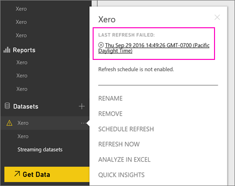
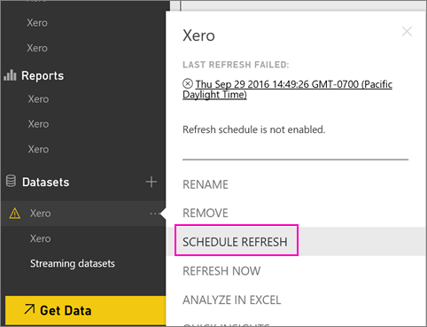
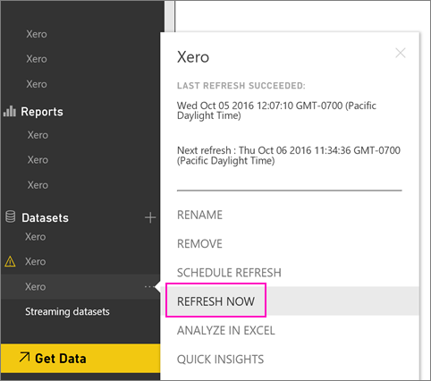

<properties 
   pageTitle="如何重新整理您 Xero 內容套件的認證"
   description="如果您使用 Xero Power BI 內容套件，您可能發生問題內容組件的每日更新，因為新的 Power BI 服務事件。"
   services="powerbi" 
   documentationCenter="" 
   authors="joeshoukry" 
   manager="erikre" 
   backup="maggiesMSFT"
   editor=""
   tags=""
   qualityFocus="no"
   qualityDate=""/>
 
<tags
   ms.service="powerbi"
   ms.devlang="NA"
   ms.topic="article"
   ms.tgt_pltfrm="NA"
   ms.workload="powerbi"
   ms.date="10/07/2016"
   ms.author="yshoukry"/>

# 如何重新整理您 Xero 內容套件的認證，如果重新整理失敗

如果您使用 Xero Power BI 內容套件，您可能會發生內容組件的每日更新，因為新的 Power BI 服務事件的一些問題。

如果您的內容套件會重新整理成功，您可以看到藉由檢查上次重新整理狀態 Xero 資料集，如以下螢幕擷取畫面所示。

如果您看到該重新整理失敗如上所示，請依照下列步驟來更新您的內容套件的認證。

1. 按一下您的 Xero 資料集旁邊的省略符號 （...），然後按一下 [ **排程重新整理**。 這會開啟 Xero 內容組件的 [設定] 頁面。

    
 
2. 在 **Xero 設定** 頁面上，選取 **資料來源認證** > **編輯認證**。

    

3. 輸入您的組織名稱 > **下一步**。

    

4. Xero 帳戶登入。

    

4. 現在，您的認證會更新，讓我們來確定設定重新整理排程每日執行。 按一下您的 Xero 資料集旁邊的省略符號 （...），然後按一下 [檢查 **排程重新整理** 一次。

    

5. 您也可以選擇立即重新整理資料集。 按一下您的 Xero 資料集旁邊的省略符號 （...），然後按一下 [ **立即重新整理**。

    

如果您仍然有重新整理問題，請寄信到與我們聯繫在 [http://support.powerbi.com](http://support.powerbi.com) 

若要深入了解 Power BI 的 Xero 內容組件，請造訪 [Xero 內容的組件說明網頁](powerbi-content-pack-xero.md)。

### 請參閱  

-  更多的問題嗎？ [試用 Power BI 社群](http://community.powerbi.com/)
