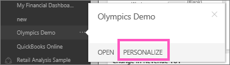

<properties
   pageTitle="重新命名的 Power BI 儀表板"
   description="重新命名的 Power BI 儀表板。"
   services="powerbi"
   documentationCenter=""
   authors="mihart"
   manager="mblythe"
   backup=""
   editor=""
   tags=""
   qualityFocus="no"
   qualityDate=""/>

<tags
   ms.service="powerbi"
   ms.devlang="NA"
   ms.topic="article"
   ms.tgt_pltfrm="NA"
   ms.workload="powerbi"
   ms.date="10/07/2016"
   ms.author="mihart"/>
# 重新命名的 Power BI 儀表板

## 重新命名儀表板

以滑鼠右鍵按一下 [儀表板名稱，然後選取 **重新命名**。

## 無法重新命名儀表板嗎？

-   如果儀表板有此圖示 

    共用圖示會告知您正在儀表板 [共用](powerbi-service-share-unshare-dashboard.md) 與您或組織內容套件的一部分。  

-   共用的儀表板處於唯讀狀態，並無法重新命名。 

-   如果儀表板是內容的組件的一部分，您可以個人化，並將它重新命名該方法。

    

閱讀更多 [設計您的儀表板的秘訣](powerbi-service-tips-for-designing-a-great-dashboard.md)。

## 請參閱

[在 Power BI 儀表板](powerbi-service-dashboards.md)

[Power BI-基本概念](powerbi-service-basic-concepts.md)

更多的問題嗎？ [試用 Power BI 社群](http://community.powerbi.com/)
