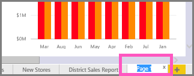
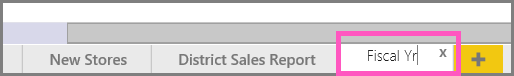

<properties
   pageTitle="重新命名在 Power BI 報表頁面"
   description="有關如何重新命名報表頁面 Microsoft Power BI 服務中的文件。"
   services="powerbi"
   documentationCenter=""
   authors="mihart"
   manager="mblythe"
   backup=""
   editor=""
   tags=""
   featuredVideoId="UOKbxTXZrWw"
   qualityFocus="no"
   qualityDate=""/>

<tags
   ms.service="powerbi"
   ms.devlang="NA"
   ms.topic="article"
   ms.tgt_pltfrm="NA"
   ms.workload="powerbi"
   ms.date="08/25/2016"
   ms.author="mihart"/>
# 重新命名在 Power BI 報表頁面

##  當我重新命名報表頁面時，會發生什麼事？

不喜歡網頁在 Power BI 報表中的名稱嗎？  您只要按一下新的名稱。 

<iframe width="560" height="315" src="https://www.youtube.com/embed/UOKbxTXZrWw?list=PL1N57mwBHtN0JFoKSR0n-tBkUJHeMP2cP" frameborder="0" allowfullscreen></iframe>

1.  在報表開啟 [編輯檢視](powerbi-service-go-from-reading-view-to-editing-view.md)。

2. 找出報表頁面索引標籤底部的 [Power BI] 視窗。

    

2.  開啟您想要重新命名所選取的索引標籤 [報表] 頁面。

4. 連按兩下加以反白顯示] 索引標籤上的名稱。  

    

5. 輸入新的報表頁面名稱，然後選擇 ENTER。

    

##  請參閱

[重新命名報表](powerbi-service-rename-a-report.md)

深入了解 [Power BI 中的報表](powerbi-service-reports.md)

[Power BI-基本概念](powerbi-service-basic-concepts.md)*

更多的問題嗎？ [試用 Power BI 社群](http://community.powerbi.com/)
