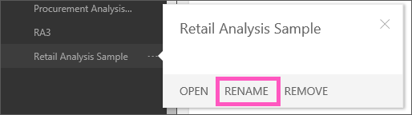

<properties
   pageTitle="在 Power BI 中的報表重新命名"
   description="在 Power BI 中的報表重新命名"
   services="powerbi"
   documentationCenter=""
   authors="mihart"
   manager="mblythe"
   backup=""
   editor=""
   tags=""
   qualityFocus="no"
   qualityDate=""/>

<tags
   ms.service="powerbi"
   ms.devlang="NA"
   ms.topic="article"
   ms.tgt_pltfrm="NA"
   ms.workload="powerbi"
   ms.date="10/07/2016"
   ms.author="mihart"/>
# 在 Power BI 中的報表重新命名

##  當我重新命名報表時，會發生什麼事？

不喜歡在 Power BI 報表的預設名稱嗎？  您只要按一下新的名稱。  重新命名報表並不會重新命名相關聯的資料集，或 [重新命名相關聯的儀表板](powerbi-service-rename-a-dashboard.md)。

## 重新命名報表

1.  在左方瀏覽窗格中，找出的報表，按一下滑鼠右鍵，然後選取 **重新命名**。

    

2.  輸入新名稱。

##  請參閱

深入了解 [Power BI 中的報表](powerbi-service-reports.md)

[Power BI-基本概念](powerbi-service-basic-concepts.md)*

更多的問題嗎？ [試用 Power BI 社群](http://community.powerbi.com/)
