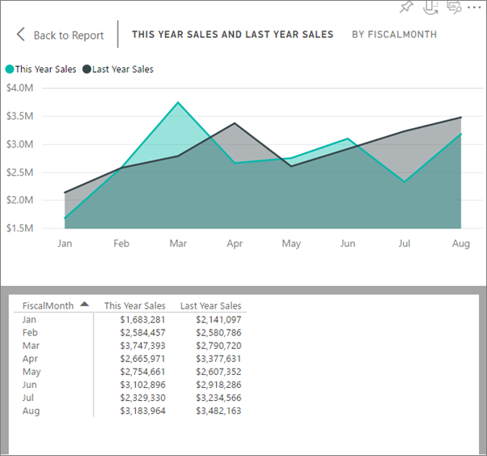

<properties
   pageTitle="查看用來建立視覺效果的資料"
   description="本文件說明如何檢視用來建立視覺效果，在 Power BI 中的資料。"
   services="powerbi"
   documentationCenter=""
   authors="mihart"
   manager="mblythe"
   backup=""
   editor=""
   tags=""
   qualityFocus="no"
   qualityDate=""/>

<tags
   ms.service="powerbi"
   ms.devlang="NA"
   ms.topic="article"
   ms.tgt_pltfrm="NA"
   ms.workload="powerbi"
   ms.date="09/12/2016"
   ms.author="mihart"/>

# 顯示視覺效果背後的資料

Power BI 視覺是使用您的資料集的資料建構的。 如果您有興趣看看幕後，Power BI 可讓您顯示用來建立視覺效果的資料。

1.  在 Power BI 服務中，開啟報表 [讀取檢視](powerbi-service-open-a-report-in-reading-view.md) 或 [編輯檢視](powerbi-service-go-from-reading-view-to-editing-view.md), ，然後選取 [視覺效果。  在 Power BI Desktop 中開啟報表] 檢視中。

2.  若要查看視覺效果背後的資料，請選取 **瀏覽** > **看到資料**。

3.  根據預設，資料會顯示下列視覺效果。  若要變更此設定，在視覺效果的右上角中，選取 **切換至垂直版面配置** 圖示 。

    

4.  若要將資料匯出至.csv 檔案中，選取 **匯出資料**。

    

5. 若要隱藏的資料，請取消選取 **瀏覽** > **看到資料** 或選取 **隱藏資料** 圖示  從視覺效果的右上角。

### 請參閱

[Power BI 報表中的視覺效果](powerbi-service-visualizations-for-reports.md)

[Power BI 報表](powerbi-service-reports.md)

[Power BI-基本概念](powerbi-service-basic-concepts.md)

更多的問題嗎？ [試用 Power BI 社群](http://community.powerbi.com/)
