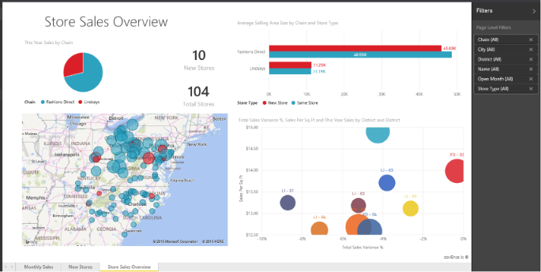

<properties
   pageTitle="在 Power BI 中的報表"
   description="在 Power BI 中的報表"
   services="powerbi"
   documentationCenter=""
   authors="mihart"
   manager="mblythe"
   backup=""
   editor=""
   tags=""
   qualityFocus="no"
   qualityDate=""/>

<tags
   ms.service="powerbi"
   ms.devlang="NA"
   ms.topic="article"
   ms.tgt_pltfrm="NA"
   ms.workload="powerbi"
   ms.date="10/05/2016"
   ms.author="mihart"/>
# 在 Power BI 中的報表

儀表板、 報表和資料集是 Power BI 的核心。 A **報表** 的多重遠近景深檢視是在您的資料，以代表不同的結果和深入觀點，從該資料的視覺效果。  報表可能需要單一的視覺效果或完整的視覺效果的頁面。

需要了解 Power BI 所組成的建置組塊的協助嗎？  請參閱 [Power BI-基本概念](powerbi-service-basic-concepts.md)。

您可以 [從頭開始建立報表](powerbi-service-create-a-new-report.md) 或 [有一個與您共用](powerbi-service-share-unshare-dashboard.md)。 與某些類型的資料，將 Power BI [為您建立報表，因為它可提高資料集](powerbi-service-get-data.md)。  

## 在瀏覽窗格中檢視報表

當您加入報表，power BI 可以有多個報表，其標題加入至下方的清單 **報表** 標題 （請參閱以下螢幕擷取畫面）。 您目前正在檢視的報表會反白顯示。 新的報表有一個黃色星號。 一次可以開啟一個報表。

## 如需有關報表的詳細資訊︰

從資料表中的內容 （在此瀏覽器頁面的左邊），依序展開 **報表** 若要查看所有 Power BI 報表與相關的主題。

### 秘訣與疑難排解

- 別忘了， [建立報表](powerbi-service-create-a-new-report.md)  需要 [資料集](powerbi-service-get-data.md)。  

- 請確定您了解差異 [讀取檢視](powerbi-service-interact-with-a-report-in-reading-view.md) 和 [編輯檢視](powerbi-service-interact-with-a-report-in-editing-view.md)。 

- 熟悉報表編輯器 [導覽](powerbi-service-the-report-editor-take-a-tour.md)。

- 修改您的報表顯示使用 [頁面上顯示設定](powerbi-service-change-report-display-settings.md)。

- 您知道篩選、 反白顯示、 交叉篩選和交叉醒目提示的差異嗎？ 如果沒有，請參閱 [篩選並反白顯示報表資料的](powerbi-service-about-filters-and-highlighting-in-reports.md)。

- 
            [焦點模式](powerbi-service-move-and-resize-a-visualization.md) 和 [全螢幕電視模式](powerbi-service-dash-and-reports-fullscreen.md) -有所差異。

## 另請參閱

[開始使用 Power BI](powerbi-service-get-started.md) 

[Power BI-基本概念](powerbi-service-basic-concepts.md)

更多的問題嗎？ [試用 Power BI 社群](http://community.powerbi.com/)
