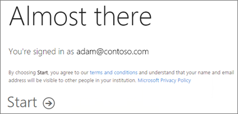
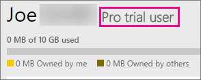
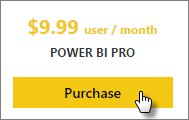
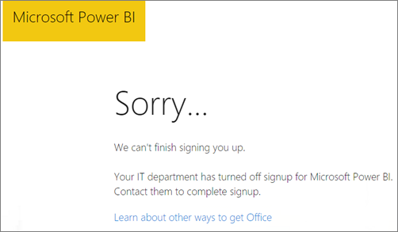

<properties
   pageTitle="自助式註冊 Power bi"
   description="自助式註冊 Power bi。 這會查看如何個人可以註冊 Power BI （免費），試用或購買 Power BI Pro。"
   services="powerbi"
   documentationCenter=""
   authors="guyinacube"
   manager="erikre"
   backup=""
   editor=""
   tags=""
   qualityFocus="no"
   qualityDate=""/>

<tags
   ms.service="powerbi"
   ms.devlang="NA"
   ms.topic="get-started-article"
   ms.tgt_pltfrm="NA"
   ms.workload="powerbi"
   ms.date="10/10/2016"
   ms.author="asaxton"/>
# 自助式註冊 Power bi

註冊 Power BI，為個別且很容易 ！ 您可以選擇使用免費帳戶、 Pro 試用帳戶或購買 Power BI Pro，即使您是在現有的組織。 一旦您決定您想要使用，本文將逐步引導您逐步完成啟動並執行。

> [AZURE.NOTE] 如果您是在組織中，個別登上可能會停用。 請參閱 [個別註冊關閉](#individual-sign-up-has-been-turned-off) 如需詳細資訊如果您收到錯誤，指出已關閉。

## 哪些電子郵件地址可以搭配 Power BI？

Power BI 會要求您使用公司或學校，若要註冊的電子郵件地址。 Power BI 不支援取用者的電子郵件服務或電信提供者所提供的電子郵件地址。 這包括 outlook.com、 hotmail.com、 gmail.com 等等。

如果您嘗試登入，以個人的電子郵件地址，就會使用工作或學校電子郵件地址的訊息。

> [AZURE.NOTE] Power BI 不支援自助註冊.gov 或.mil 位址這一次。 請連絡您的 O365 管理員。

## Power BI （免費） 的個人身分登入

若要註冊 Power BI 最快的方式是註冊 Power BI （免費） 的帳戶。 此帳戶，不需要支付費用，它可讓您使用多個服務提供的功能。 [進一步了解](https://powerbi.microsoft.com/pricing/)

> [AZURE.NOTE] 如果您收到一則訊息，我們已經知道您嘗試瀏覽至 https://app.powerbi.com，登入。

若要註冊 Power BI，您可以執行下列程式碼。

1.  瀏覽至 powerbi.com。

2.  選取 **開始免費**。

    

    您可以跳到 **產品** > **定價** ，然後選取 **註冊**。
    
    

3.  在 [選擇如何開始使用] 對話方塊中，選取 **註冊** 在 Power BI。

    

4.  輸入您要註冊，然後再選取電子郵件地址 **註冊**。 請務必允許註冊的電子郵件地址。 [進一步了解](#what-email-address-can-be-used-with-power-bi)

    

5.  如果您的帳戶在組織內不存在，就會指出要檢查您的電子郵件訊息。

    

    如果您的帳戶屬於現有的組織，您會取得訊息，詢問您要使用該帳戶登入。 選取 **繼續** 並以您的 Office 365 登入登入。

    

6.  如果您收到一封電子郵件時，選取 [驗證您的電子郵件地址的電子郵件中的連結。 這將會讓您回到恢復註冊流程。 您可能需要提供一些關於您自己的額外資訊。
7.  如果您有現有的 Office 365 帳戶，您會看到一個訊息，要求您選取 **啟動**。

    
    
8.  您將會被重新導向 https://app.powerbi.com，就可以開始使用 Power BI 做為可用的使用者。

### 看起來像這樣服務內

當您在服務中，您可以確認您有一個免費帳戶，移至 **齒輪** 圖示，然後選取 **管理個人儲存體**。

 
## Power BI Pro 60 天試用版

您已註冊您的免費帳戶之後，您可以選擇性地選擇免費試用專業版。 您必須於試用期間所有的 Pro 功能的存取權。 Power BI Pro 有免費版本的 Power BI 的所有功能和其他共同作業和資料重新整理功能。 它也會有更高的資料容量和串流處理限制的資料。 如需詳細資訊，請參閱 [Power BI 定價](https://powerbi.microsoft.com/pricing)。 若要試用 60 天免費試用版 Power BI Pro，登入 Power BI，然後再試其中的 Power BI Pro 功能︰

-   建立及發行自訂 [內容組件](powerbi-service-organizational-content-packs-introduction.md)
-   共用 [可重新整理](powerbi-refresh-data.md) 小組儀表板和報表使用 [群組](powerbi-service-create-a-group-in-power-bi.md)
-   連接到內部資料使用 [個人閘道](powerbi-personal-gateway.md)
-   啟用即時的互動式連線到下列來源︰
    -   [SQL Server Analysis Services](powerbi-sql-server-analysis-services-tabular-data.md)
    -   [Azure HDInsight 上的 Spark](powerbi-spark-on-hdinsight-with-direct-connect.md)
    -   [Azure SQL 資料倉儲](powerbi-azure-sql-data-warehouse-with-direct-connect.md)
    -   [Azure SQL 資料庫](powerbi-azure-sql-database-with-direct-connect.md)

當您嘗試這些功能時，系統會提示您免費的試用版。 您也可以選擇讓前往齒輪圖示，並選取使用它 **管理個人儲存體**。 然後選取 **免費試用的 pro 提示** 右邊。

 
接著，您可以選取 **開始試用**。

> **附註**
>
>-   如果您需要更多時間評估 Power BI，您可以要求延長 60 天的試用期。
>-   利用此產品中的 Power BI Pro 試用版的使用者不會出現在 Office 365 系統管理入口網站 Power BI 專業人員的試用使用者 （它們顯示為 Power BI 免費使用者）。 它們會不過，顯示為 Power BI Pro 試用版中的使用者 **可管理儲存體** Power BI 中的頁面。
>-   如果您是 IT 系統管理員想要取得並部署至組織中的多個使用者的 Power BI 試用版授權，而不需要單獨接受試用版條款的個別使用者，您可以註冊 [試用 Power BI Pro 訂閱](https://portal.office.com/Signup/MainSignup15.aspx?OfferId=d59682f3-3e3b-4686-9c00-7c7c1c736085&dl=POWER_BI_PRO)。  您必須是 Office 365 全域或計費管理員或建立新的租用戶註冊試用版的系統管理員。 [進一步了解](powerbi-admin-purchasing-power-bi-pro.md)
 
### 看起來像這樣服務內

當您在服務中，您可以確認您有 Pro 試用帳戶，請前往 **齒輪* 圖示，然後選取 **管理個人儲存體**。

## 採購 Power BI Pro 以個人身分

您可以購買 Power BI Pro 從 [開始]，或者可以選擇您的免費試用結束後，升級到 Pro。 如果您的帳戶是組織的一部分，您可以購買 Power BI Pro 以個人身分如果組織未停用個別購買情況。

若要購買 Power BI Pro 以個人身分，您可以執行下列程式碼。

1.  瀏覽至 [powerbi.com](https://www.powerbi.com)。

2.  選取 **產品** > **定價**。

3.  選取 **購買**。

    

4.  回答引導購買所提出的問題。 為個別且將會選取一個選項 **自行**。 

    

    > 
            **請注意**︰ 如果您有興趣購買您的小組或組織所需的選項，您可以閱讀貴組織購買 Power BI Pro。 [進一步了解](powerbi-admin-purchasing-power-bi-pro.md)

5.  如果您尚未登入 Power BI，您必須使用帳戶登入 Power BI （免費）。

6.  您必須提供資訊以進行購買。

### 看起來像這樣服務內

當您在服務中，您可以確認您有 Pro 帳戶移至 **齒輪** 圖示，然後選取 **管理個人儲存體**。

## 個別註冊已關閉

若要註冊 Power BI 時，可能會遇到下列的訊息。

    Your IT department has turned off signup for Microsoft Power BI.
 

這可能是因為您的組織已停用個別登 ups。 它也可能是因為您透過協力廠商購買 Office 365。 
            [深入了解](powerbi-admin-syndication-partner.md)。

如果您的組織已停用個別登 ups，您必須使用您的 IT 團隊以取得 Power BI 授權指派給您的帳戶，才能繼續。

## 疑難排解

在許多情況下，可以依照上面所列的簡單自助式註冊程序達成 Power bi 註冊。 不過，有幾個原因為何您可能無法完成自助註冊。  下表摘要說明一些最常見的原因，您可能無法完成註冊，以及可以解決這些問題的方法。

| **徵兆 / 錯誤訊息** | **原因和解決方法** |
|---|---|
| 
            **個人電子郵件地址 (例如 nancy@gmail.com)** 您收到訊息，以在註冊期間如下︰    *您已輸入個人電子郵件地址︰ 請輸入您的公司電子郵件地址，因此我們可以安全地儲存貴公司的資料。*    或    *看起來像個人的電子郵件地址。 輸入您工作的地址，讓我們可以先將您與其他人連線，在您的公司。 此外，別擔心。 我們將不會與任何人共用您的地址。* | Power BI 不支援取用者的電子郵件服務或電信提供者所提供的電子郵件地址。    若要完成註冊，請嘗試再次使用指派的公司或學校電子郵件地址。    如果仍然無法註冊，而且願意完成更進階的安裝程序，您可以 [註冊新的 Office 365 試用訂閱和使用該電子郵件地址登入，](powerbi-admin-signing-up-for-power-bi-with-a-new-office-365-trial.md)。 |
| 
            **.gov 或.mil 電子郵件地址** 您收到訊息，以在註冊期間如下︰    *Power BI 無法使用︰ Power BI 不適用於具有.gov 或.mil 電子郵件地址的使用者在此階段。 使用另一個工作電子郵件地址，或稍後再回來查看。*    或    *我們無法完成您註冊。 看來 Microsoft Power BI 目前無法使用為您的工作或學校。* | Power BI 不支援自助註冊.gov 或.mil 位址這一次。 請連絡您的 O365 管理員。 |
| 
            **停用自助式註冊** 您收到訊息，以在註冊期間如下︰    *我們無法完成您註冊。 您的 IT 部門已經關閉 Microsoft Power BI 註冊。 您可以連絡他們完成註冊。*    或    *看起來像個人的電子郵件地址。 輸入您工作的地址，讓我們可以先將您與其他人連線，在您的公司。 此外，別擔心。 我們將不會與任何人共用您的地址。* | 貴組織的 IT 系統管理員已停用自助式註冊 Power bi。    若要完成註冊，請連絡您的 IT 系統管理員並要求他們以允許註冊 Power BI，並允許新使用者加入現有的租用戶的現有使用者] 頁面上，依照指示。    如果您註冊 Office 365 透過合作夥伴，也可能會遇到這個問題。 [進一步了解](powerbi-admin-syndication-partner.md)    [在您的組織中的 power BI](https://support.office.com/en-ca/article/Power-BI-in-your-Organization-d7941332-8aec-4e5e-87e8-92073ce73dc5#BKMK_HowCanIAllowO365Tenant) |
| 
            **電子郵件地址不是 Office 365 ID** 您收到訊息，以在註冊期間如下︰    *我們找不到您在 contoso.com。  您在公司或學校使用不同的識別碼？    請嘗試登入，以及如果無法運作，請連絡您的 IT 部門。* | 您的組織使用 Id 來登入 Office 365 和其他 Microsoft 服務，不同於您的電子郵件地址。  例如，電子郵件地址可能 Nancy.Smith@contoso.com，但您的識別碼是 nancys@contoso.com。    若要完成註冊，用於指派給您的組織識別碼登入 Office 365 或其他 Microsoft 服務。  如果您不知道這是什麼，請連絡您的 IT 系統管理員。    如果您仍然無法註冊，並可以完成更進階的安裝程序，您可以 [註冊新的 Office 365 試用訂閱和使用該電子郵件地址登入，](powerbi-admin-signing-up-for-power-bi-with-a-new-office-365-trial.md)。 |

## 請參閱

[採購 Power BI Pro](powerbi-admin-purchasing-power-bi-pro.md)  
[無法新增 Office 365 夥伴訂用帳戶的 Power BI](powerbi-admin-syndication-partner.md)  
[Power BI 組織中的 （免費）](powerbi-admin-powerbi-free-in-your-organization.md)  
更多的問題嗎？ [試用 Power BI 社群](http://community.powerbi.com/)