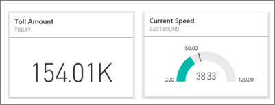
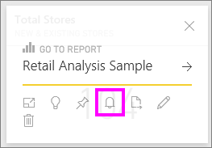
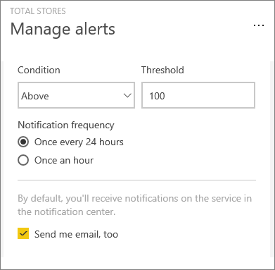
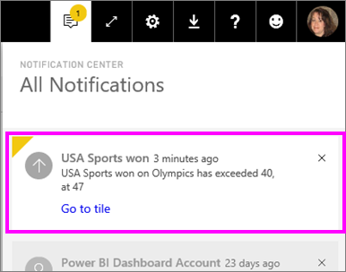
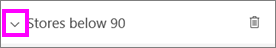

<properties
   pageTitle="在 Power BI 服務中設定資料警示"
   description="了解如何設定警示通知您在儀表板中的資料變更時超出限制您在 Microsoft Power BI 服務中設定。"
   services="powerbi"
   documentationCenter=""
   authors="mihart"
   manager="mblythe"
   backup=""
   editor=""
   tags=""
   featuredVideoId="JbL2-HJ8clE"
   qualityFocus="no"
   qualityDate=""/>

<tags
   ms.service="powerbi"
   ms.devlang="NA"
   ms.topic="article"
   ms.tgt_pltfrm="NA"
   ms.workload="powerbi"
   ms.date="10/04/2016"
   ms.author="mihart"/>

# Power BI 服務中的資料警示

設定警示通知您在儀表板中的資料變更時超出限制您的設定。  警示適用於數值卡以及量測計的磚。 只有您可以查看此設定時，會發出警示，即使您共用儀表板。 資料警示會完全同步處理跨平台。設定與檢視資料警示 [iPhone Power BI 行動應用程式中](powerbi-mobile-set-data-alerts-in-the-iphone-app.md), ，[適用於 Windows 的 Power BI 行動應用程式](powerbi-mobile-set-data-alerts-in-the-windows-10-mobile-app.md) 和 Power BI 服務。 它們不適用於 Power BI Desktop。

> [AZURE.WARNING] 資料驅動的警示通知提供您資料的相關資訊。 如果您的行動裝置上檢視 Power BI 資料，且該裝置被偷，我們建議您使用 Power BI 服務關閉所有資料驅動的警示規則。

## 在 Power BI 服務中設定資料警示
觀看 Amanda 到她的儀表板上的磚加入某些警示。 然後遵循以下視訊，試試看您自己的逐步指示。

<iframe width="560" height="315" src="https://www.youtube.com/embed/JbL2-HJ8clE" frameborder="0" allowfullscreen></iframe>

此範例使用卡片磚零售分析範例儀表板中。

1.  啟動儀表板上。 從儀表板] 方塊中，選取省略符號。

    

2.  選取鈴鐺圖示  新增一或多個警示 **存放區的總**。

    

3.  若要開始，請確定滑桿設定為 **上**, ，並提供您警示的標題。 標題幫助您輕鬆地辨識您的通知。

    

4.  向下捲動，並輸入警示的詳細資料。  在此範例中，我們將建立的警示，如果總商店數目降至 100 以上，一天一次通知我們。 在我們的通知中心內，將會顯示通知。 而且我們必須傳送的電子郵件給我們的 Power BI。

    

5. 選取 **儲存**。

## 接收警示
當正在追蹤的資料達到其中一個已設定的閾值時，將會發生幾件事。 首先，Power BI 會檢查以查看是否已超過一小時或 24 小時以上 （取決於您選取的選項） 自上一次警示已傳送。 只要資料已超出臨界值，您會收到警示。

接下來，Power BI 會傳送警示到您的通知中心，並選擇性地在電子郵件中。 每個警示包含直接連結到您的資料。 選取若要查看相關的磚探索、 共用，以及了解詳細的連結。  

1.  如果您已經設定傳送電子郵件警示，您會發現類似下面的收件匣中。

    

2.  Power BI 新增訊息至您 **通知中心** ，並將新的警示圖示加入至適用的磚。

    

4. 開啟您的通知中心，請參閱警示詳細資料。

    

>[AZURE.NOTE] 警示僅用於資料重新整理。 當資料重新整理時，Power BI 會查看警示會為該資料。 如果資料已達到警示的閾值，則會觸發警示。

## 管理警示
有三種方式來管理您的通知︰ 儀表板中並排顯示本身，從 Power BI 設定] 功能表，以及在個別的磚上 [iPhone 上的 Power BI 行動應用程式](powerbi-mobile-set-data-alerts-in-the-iphone-app.md) 或 [Power BI for Windows 10 行動裝置應用程式](powerbi-mobile-set-data-alerts-in-the-windows-10-mobile-app.md)。

###   從本身的並排顯示

1. 如果您需要變更或移除磚的警示，請重新開啟 **管理警示** 選取鈴鐺圖示 。 會顯示您所設定的並排顯示的所有警示。

    。

2. 若要修改警示，選取的警示名稱左側的箭號。

    。

3. 若要刪除警示時，選取右邊的警示名稱垃圾桶。

      

###   從 Power BI 設定] 功能表
1. 從 Power BI 功能表列中選取齒輪圖示。

    。

2. 在 **設定** 選取 **警示**。

    

3. 從這裡您可以開啟警示開啟及關閉開啟 **管理警示** ] 視窗中進行變更，或刪除警示。

## 秘訣與疑難排解

-  警示目前不支援 Bing 磚，或使用日期/時間量值的卡片磚。

-  警示只適用於數值資料型別。

-  警示僅用於資料重新整理。 它們無法在靜態資料運作。

### 請參閱
- [在 iphone 上設定資料警示](powerbi-mobile-set-data-alerts-in-the-iphone-app.md)
- 
            [開始使用 Power BI](powerbi-service-get-started.md) 更多的問題嗎？ [試用 Power BI 社群](http://community.powerbi.com/)
