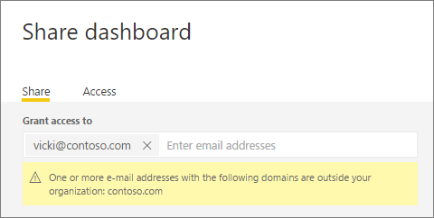
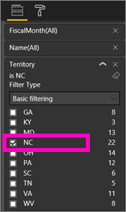
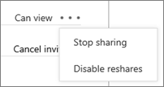

<properties
   pageTitle="與同事和其他人共用儀表板和報表"
   description="如何與您的組織內外的同事共用 Power BI 儀表板和報表，您需要了解共用。"
   services="powerbi"
   documentationCenter=""
   authors="ajayan"
   manager="mblythe"
   backup=""
   editor=""
   tags=""
   featuredVideoId="0tUwn8DHo3s"
   qualityFocus="identified"
   qualityDate="06/22/2016"/>

<tags
   ms.service="powerbi"
   ms.devlang="NA"
   ms.topic="article"
   ms.tgt_pltfrm="NA"
   ms.workload="powerbi"
   ms.date="10/13/2016"
   ms.author="maggies"/>

# 與同事和其他人共用儀表板和報表

您可以與同事共用您的儀表板和報表，您的組織內外。 如果他們還沒有登入 [Power BI](http://powerbi.com), ，他們必須執行這項操作，以查看您的儀表板。

您可以共用，您可以將它與分享取決於您和他們的 Power BI 授權。 請參閱 [授權需求共用](powerbi-service-share-unshare-dashboard.md#licensing-requirements-for-sharing) 如下如需詳細資訊。

儀表板和報表，將會與您共用處於唯讀狀態。  無法儲存-對於個人化。 相反地，您可以讓您自己的儀表板和報表中的複本 [組織內容套件](powerbi-service-organizational-content-packs-introduction.md)。  請參閱 [方式應該共用我的儀表板](powerbi-service-how-should-i-share-my-dashboard.md)？ 決定何者最適合您情況的選項。

>
            **請注意**︰ 您共用儀表板和報表，Power BI 服務或 Power BI 行動應用程式，但無法從 Power BI Desktop。

觀看 Amanda 與她公司內外的同事分享她儀表板。 然後遵循以下視訊，試試看您自己的逐步指示。

<iframe width="560" height="315" src="https://www.youtube.com/embed/0tUwn8DHo3s?list=PL1N57mwBHtN0JFoKSR0n-tBkUJHeMP2cP" frameborder="0" allowfullscreen></iframe>

## 共用儀表板

1.   開啟儀表板，然後選取 **共用** 。

2.  選取 **中 vite** 和在最上方的方塊中輸入電子郵件地址以及 （選擇性） 修改訊息。

      

    您可以與其位址是您組織外部的人共用，但是您會看到一則警告。

      

3.  若要讓您的同事共用儀表板與其他人，請檢查 **允許收件者共用您的儀表板**。

    只有在您的組織中的同事可以重新共用儀表板。 您組織外部的人可以檢視您的儀表板，但不是重新共用。

4.  選取 **共用。**

    Power BI 傳送電子郵件邀請的連結至共用的儀表板。 按一下連結將您的同事 Power BI 服務儀表板。 他們會看到這個圖示  旁邊共用儀表板，在與他們共用指出儀表板。

    如果它們尚未註冊 Power BI，他們可以建立帳戶之後按下連結。

    >
            **請注意**︰ 共用經驗是不同的組織外部人士。 請參閱 [當您與人共用您組織外部](powerbi-service-share-unshare-dashboard.md#when-you-share-your-dashboard-with-people-outside-your-organization) 如下如需詳細資訊。

5.  若要查看誰已經已共用的儀表板，請選取 **存取**。

    

    組織外部人士列為 **來賓**。

## 共用儀表板的相關注意事項

當您共用儀表板︰

-   任何人分享，可以看到儀表板，並與您的報表互動 [讀取檢視](powerbi-service-open-a-report-in-reading-view.md)。 無法建立新的報表或將變更儲存至現有的報表。

-   甚至，每個人都可以看到所做的變更。

-   沒有人可以看到，或下載資料集。

-   每個人都可以手動 [重新整理儀表板資料](powerbi-refresh-data.md)。

### 當您與同事共用儀表板

-   如果您使用 Office 365 電子郵件時，您可以藉由輸入通訊群組相關聯的電子郵件地址共用與通訊群組的成員。

-   具有相同的電子郵件網域，為您的同事和其網域為不同，但在租用戶已註冊的同事可以重新共用儀表板。 例如，假設網域 contoso.com 和 contoso2.com 租用戶中註冊。 如果您的電子郵件地址是 konrads@contoso.com, 然後兩者 ravali@contoso.com 和 gustav@contoso2.com 可以重新共用。

    
            **提示︰** 如果您的同事已經有存取特定的儀表板，您可以傳送的直接連結到該儀表板只複製的 URL，當您在儀表板。 例如：   

    https://powerbi.com/dashboards/g12466b5-a452-4e55-8634-xxxxxxxxxxxx

## 當您共用儀表板與人組織外部

當您組織外部共用的人時，他們會收到電子郵件共用的儀表板的連結。 他們必須登入 Power BI 以查看儀表板。 如果沒有 Power BI 帳戶，他們可以建立一個按下連結之後。

登入後，就會看到左的導覽窗格中沒有其瀏覽器視窗中，在其平常的 Power BI 入口網站中的共用儀表板。 他們也必須設為書籤連結未來存取此儀表板。

無法編輯此儀表板或報表中的任何內容。 它們可以與互動的圖表報表 （跨醒目顯示） 中，變更任何篩選條件/交叉分析篩選器連接至儀表板的報表上。

只有您直接的收件者可以看到共用儀表板。 在上述範例，只有 Vicki@contoso.com 可以查看儀表板。 沒有人還可以看到該儀表板，即使它們有連結，而 Vicki 來存取該儀表板中使用相同的電子郵件地址。 如果她註冊任何其他的電子郵件地址，她就可能沒有存取儀表板。

如果內部部署 Analysis Services 表格式模型上實作角色或資料列層級安全性，您組織外部的人員無法顯示任何資料。

## 共用只報告
我們已了解當您共用儀表板已連結至報表的磚，會也這些報表共用相同的時間。 但如果在您想要共用只報表嗎？ 只要將報表頁面的 URL 傳送給您的同事。 只要它們是相同的通訊群組，與您相同電子郵件網域的成員，或連結到該相同的報表 （儀表板，已從該報表釘選的磚） 必須至少一個儀表板，他們就能夠開啟報表。

請參閱 [當您與同事分享上述](powerbi-service-share-unshare-dashboard.md#when-you-share-your-dashboard-with-colleagues)。

### 共用報表篩選的的版本
如果您要共用的報表篩選的版本？ 也許只會顯示特定城市或銷售人員或年的資料報表。 這可以由建立自訂的 URL。

1.   在報表開啟 [編輯檢視](powerbi-service-go-from-reading-view-to-editing-view.md) ，並套用篩選。 在此範例中，我們要篩選 [零售分析範例](powerbi-sample-tutorial-connect-to-the-samples.md) 顯示只有學區 FD-01。

    

2.  報表頁面 URL 的結尾加入下列︰

    ？ 篩選 = tablename/fieldname eq 值

    在本例中，資料表的名稱是 **存放區**, ，欄位的名稱是 **領域**, ，我們想要篩選的值是 **NC**。

    

    您的瀏覽器會新增至代表斜線和空格，因此您會得到一些特殊字元︰

    app.powerbi.com/groups/me/reports/010ae9ad-a9ab-4904-a7a1-10a61f70f2f5/ReportSection2?filter=Store%252FTerritory%20eq%20NC

    >[AZURE.NOTE]此欄位必須是型別 **字串** 和表格名稱或欄位名稱不可以包含空格。

3.  將這個 URL 傳送給您的同事。 當使用者按一下連結時，Power BI 會開啟篩選報告的唯讀版本。

## 共用的授權需求

兩者都有相同的授權要求共用您的組織內部和外部內容。

如果您只有免費的 Power BI 功能建立儀表板，您的收件者只需要免費的 Power BI 授權檢視的內容。 如果您使用 Power BI Pro 的功能，例如群組或內部部署連線，您的收件者需要 Power BI Pro 的授權，才能檢視內容。

請參閱 [Power BI Pro 內容-它是什麼？](powerbi-power-bi-pro-content-what-is-it.md) 如需更完整的清單。

定價] 頁面上，此 Power BI [使用 Power BI for 免費或購買 Power BI Pro](https://powerbi.microsoft.com/pricing), ，也是很有用的比較兩個選項。

## Resharing

Resharing 可讓您的同事轉寄電子郵件邀請給其他人在組織中的 （一個月後到期邀請）。 同事也可以透過 Power BI 服務和行動應用程式共用。 為儀表板擁有者，您可以關閉 resharing，您也可以撤銷 resharing 個別 （如下所示）。

無法重新共用組織外部人士。

## 取消共用儀表板

1.  開啟儀表板，然後選取 **共用** 。

2.  選取 **存取** 若要查看完整的人員清單。

    

3.  選取省略符號 (**...**) 旁邊 **可以檢視** ，然後選取︰

    

    -   
            **停止共用** 與該人員或

    -   
            **停用 reshares** 以防止該使用者與其他人共用。

    -   如果使用者尚未尚未接受您共用的邀請，或者 **取消邀請**。

## 關閉 resharing

儀表板擁有者可以開啟和關閉 resharing。

-   如果您還沒有傳送尚未共用的邀請，清除 **允許收件者共用您的儀表板** 邀請底部的核取方塊。

-   如果同事您尚未接受您的共用邀請，取消邀請，但不選取再次邀請 **允許收件者共用您的儀表板**。

-   如果他們接受您共用的邀請，請選取 **存取**, ，選取省略符號 (**...**) 旁邊 **可以檢視** 按一下 **停止共用**。

    

### 請參閱

- 
            [如何共用我的儀表板？](powerbi-service-how-should-i-share-my-dashboard.md)
- 
            [共用的儀表板連結到 Excel 檔案](powerbi-service-share-dashboard-that-links-to-excel.md)
- 
            [Power BI Pro 內容-它是什麼？](powerbi-power-bi-pro-content-what-is-it.md)
- 
            [使用 Power BI 免費或購買 Power BI Pro](https://powerbi.microsoft.com/pricing)
- 
            [開始使用 Power BI](powerbi-service-get-started.md)
- 更多的問題嗎？ 
            [試用 Power BI 社群](http://community.powerbi.com/)。
