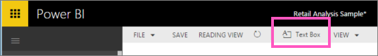

<properties
   pageTitle="Power BI 報表中的文字方塊"
   description="新增和建立 Microsoft Power BI 報表中的文字方塊中的相關文件。"
   services="powerbi"
   documentationCenter=""
   authors="mihart"
   manager="mblythe"
   backup=""
   editor=""
   tags=""
   qualityFocus="no"
   qualityDate=""/>

<tags
   ms.service="powerbi"
   ms.devlang="NA"
   ms.topic="article"
   ms.tgt_pltfrm="NA"
   ms.workload="powerbi"
   ms.date="10/07/2016"
   ms.author="mihart"/>
# Power BI 報表中的文字方塊

在 [編輯] 檢視中，將文字方塊加入報表，然後將它釘選到儀表板。 

##  將文字方塊加入報表
1.  將游標放在報表畫布上的任何位置，然後選取 **文字方塊**。

    

2.  您的文字輸入文字方塊中，並選擇性地格式字型、 色彩以及文字對齊方式。 

    

3.  若要將文字方塊中，選取上方的灰色區域並拖曳。 要調整大小的文字方塊中，選取並拖曳任何外框的控制代碼。 

    

4.  若要關閉 [] 文字方塊中，選取報表畫布上的任何空白區域。

5.  選取 [釘選圖示   釘選到儀表板的文字方塊。 

### 請參閱

[加入文字方塊中的超連結](powerbi-service-add-a-hyperlink-to-a-text-box.md)

[在 Power BI 中的報表](powerbi-service-reports.md)

[Power BI 報表中的視覺效果](powerbi-service-visualizations-for-reports.md)

[Power BI-基本概念](powerbi-service-basic-concepts.md)

更多的問題嗎？ [試用 Power BI 社群](http://community.powerbi.com/)
