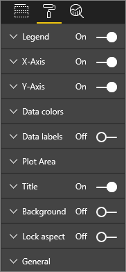
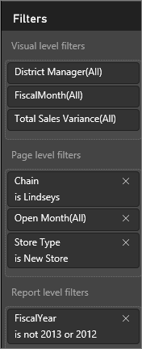

<properties
   pageTitle="報表編輯器中...導覽"
   description="報表編輯器中...進行導覽。"
   services="powerbi"
   documentationCenter=""
   authors="mihart"
   manager="mblythe"
   backup=""
   editor=""
   tags=""
   qualityFocus="no"
   qualityDate=""/>

<tags
   ms.service="powerbi"
   ms.devlang="NA"
   ms.topic="article"
   ms.tgt_pltfrm="NA"
   ms.workload="powerbi"
   ms.date="09/21/2016"
   ms.author="mihart"/>
# 報表編輯器中...導覽

            [在 [編輯] 檢視中開啟 Power BI 報表](powerbi-service-go-from-reading-view-to-editing-view.md)。

Power BI 報表編輯器由 3 個窗格所組成︰  **欄位**, ，**視覺效果**, ，和 **篩選**, ，加上的上方導覽列和報表畫布。  

## 報表編輯器窗格

窗格的左邊，視覺效果和篩選，控制哪些視覺效果看起來像是-輸入時，篩選的色彩。  並在右側欄位中，控制項的視覺效果中所使用的基礎資料的窗格。 

報表編輯器所顯示的內容會因您在報表畫布中進行的選取。  例如，當您選取個別的視覺、 

-   視覺效果] 窗格頂端會識別在使用中，visual 的型別 
-   視覺效果] 窗格的底部會顯示視覺效果中, 所使用的欄位
-   [篩選] 窗格會顯示已套用任何篩選器和
-   [欄位] 清單會識別在使用資料表 （和欄位，如果資料表尚未展開的話）。

## [視覺效果] 窗格中 （從上到下）

選取視覺效果類型、 新增和管理的欄位，來建置 visual studio 和自訂 visual studio 的外觀及操作。

### 選取圖示的不同視覺類型之間進行變更。

### 控制 visual studio 中使用的欄位。

此窗格中顯示的值區的已選取的視覺效果類型而有所不同。  例如，如果您已選取橫條圖，您會看到的值區︰ 值、 軸和圖例。 當您選取欄位，或將它拖曳到畫布上時，Power BI 會將該欄位加入其中一個值區。  您也可以從欄位清單拖曳欄位，直接將視覺效果的值區。  某些值區僅限於特定類型的資料。  例如， **值** 不接受非數值欄位。 因此，如果您拖曳 **employeename** 欄位到 **值** 桶，Power BI 其變更為 **計數 employeename**。

### 若要移除欄位

若要移除的視覺效果的欄位，請選取欄位，然後按一下 **X**。

如需詳細資訊，請參閱 [視覺效果加入 Power BI 報表](powerbi-service-add-visualizations-to-a-report-i.md)

### 格式化視覺效果

選取小畫家圖示，以顯示自訂選項。 

-   [自訂視覺效果標題、 背景和圖例](powerbi-service-tutorial-customize-visualization-title-background-and-legend.md)
-   [色彩設定](powerbi-service-getting-started-with-color-formatting-and-axis-properties.md)
-   [自訂 x 軸和 y 軸屬性](powerbi-service-tutorial-customize-x-axis-and-y-axis-properties.md)

    

## [篩選] 窗格

檢視、 設定，及修改頁面、 報表和視覺層級篩選。

如需詳細資訊，請參閱 [將篩選加入至報表](powerbi-service-add-a-filter-to-a-report.md)。

## [欄位] 窗格 

[欄位] 窗格會顯示在資料中存在的欄位與資料表。  您可以使用這些欄位來建立視覺效果。

-   將欄位拖曳到頁面以啟動新的視覺效果。  您也可以將欄位拖曳到現有的視覺效果來加入欄位。

-   或者，選取欄位旁的核取方塊。  如果畫布上選取了視覺效果，則新欄位加入至該視覺效果。

-   無論如何，每個選取的欄位會加入至報表編輯器的視覺效果窗格。

            **請注意**︰ 如果您使用 Power BI Desktop，您可以連線到選項，以顯示/隱藏欄位中，加入計算等，也會從此處︰

### 欄位圖示代表什麼意思？

- 
              **∑ 彙總** 彙總是會加總或平均，例如一個數字值。 （您的報表為基礎的資料模型中定義） 的資料匯入彙總。
  如需詳細資訊，請參閱 [Power BI 報表中的彙總](powerbi-service-aggregates.md)。

-   **導出的欄位或量值**  
    每一個導出欄位都有它自己硬式編碼的公式。 您無法變更計算，例如，如果總和，它只能加總。 如需詳細資訊， [閱讀了解量值](powerbi-desktop-measures.md)

-  **唯一的欄位**  
    此圖示的欄位已從 Excel 匯入，設定為顯示所有的值，即使使用者具有重複的項目。 例如您的資料可能有兩筆記錄的人，名為 John Smith，而且每個會視為唯一--它們不會加總。  

-  ** 地理位置欄位**  
    位置欄位可以用來建立地圖視覺效果。 

-  ** 階層**  
    選取箭頭以顯示階層所組成的欄位。 

## 在上方導覽列
從上方導覽列中可用的動作是許多;使用新的動作已加入所有的時間。 如需特定的動作，使用 Power BI 文件的目錄或搜尋方塊。

## 後續步驟︰

[編輯報表](powerbi-service-interact-with-a-report-in-editing-view.md)

[建立報表](powerbi-service-create-a-new-report.md)

## 請參閱

深入了解 [Power BI 中的報表](powerbi-service-reports.md)

[開始使用 Power BI](powerbi-service-get-started.md)

[Power BI-基本概念](powerbi-service-basic-concepts.md)

更多的問題嗎？ [試用 Power BI 社群](http://community.powerbi.com/)
