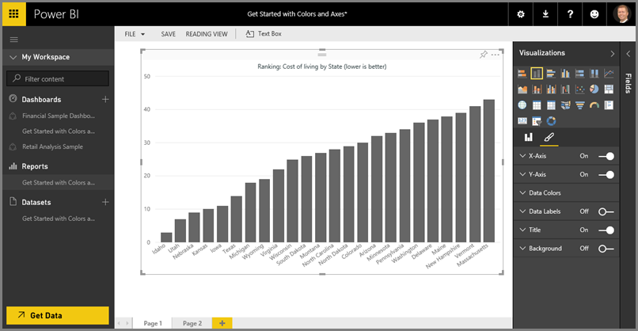
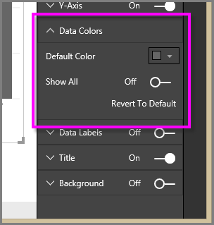
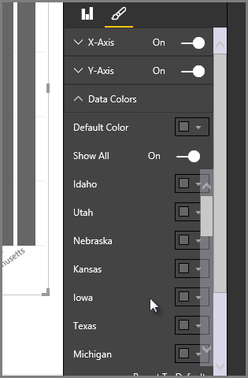
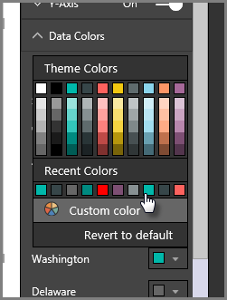
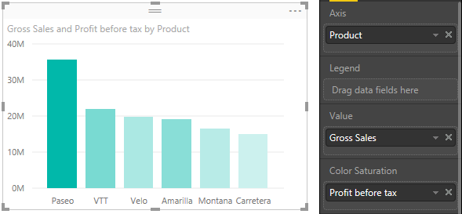
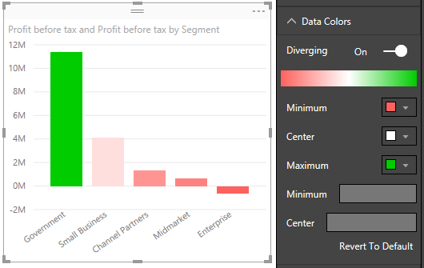

<properties
   pageTitle="色彩設定 Power BI 中的秘訣與竅門"
   description="色彩設定 Power BI 中的秘訣與竅門"
   services="powerbi"
   documentationCenter=""
   authors="davidiseminger"
   manager="mblythe"
   backup=""
   editor=""
   tags=""
   qualityFocus="no"
   qualityDate=""/>

<tags
   ms.service="powerbi"
   ms.devlang="NA"
   ms.topic="article"
   ms.tgt_pltfrm="NA"
   ms.workload="powerbi"
   ms.date="10/12/2016"
   ms.author="davidi"/>

# 色彩設定 Power BI 中的秘訣與竅門

Power BI 提供許多不同的方式來自訂您的儀表板和報表。 此文章詳細資訊的集合秘訣，讓 Power BI 視覺效果更吸引人，有趣的且您的需求加以自訂。

提供下列秘訣。 有另一個絕佳的秘訣嗎？ 太棒了！ 我們的方式傳送資料，我們會看到關於新增至此清單。

-   變更的單一資料點的色彩

-   圖表的色彩會根據數字的值

-   根據欄位值的資料點的色彩

-   自訂色階中使用的色彩

-   使用分歧色彩調整

-   如何在 Power BI 中復原

若要進行任何變更，您必須編輯報表︰ 選取您 **報表** 從 **我的工作區** ] 窗格中，然後選取 **編輯報表** 從頂端功能表區域，如下圖所示。

當 **視覺效果** ] 窗格的右邊出現 **報表** 畫布上，您即可開始自訂。

## 變更的單一資料點的色彩

有時候您會想要反白顯示一個特定的資料點。 也許是推出新產品的銷售數字，或增加品質分數之後啟動新的程式。 透過 Power BI，您都可以變更其色彩來醒目提示特定資料點。

下列的視覺化排列次序成本的生活方面的狀態。 

現在假設您想要快速地顯示在華盛頓州落在該等級的清單中，使用色彩。 步驟如下︰

展開 **資料色彩** 一節。 以下會出現。

設定 **全部顯示** 到 **上**。 這會為每個資料元素的色彩顯示視覺效果中。 因此您可以修改任何資料點，當您暫留在資料點時，捲動會啟用。

在此情況下，讓我們變更 **華盛頓** 為綠色。 我們向下捲動至 **華盛頓** 並選取其色彩] 方塊內的向下箭頭，然後色彩選取項目] 視窗隨即出現。

一旦選取此選項， **華盛頓** 資料點是好淺綠色，而且肯定凸顯出來。

即使您變更視覺效果類型，然後傳回，Power BI 會記住您的選擇，並保留 **華盛頓** 綠色。

您可以變更一個以上的資料元素的資料點的色彩。 下圖中，在 **亞歷桑那** 是紅色，和 **華盛頓** 仍然是綠色。

有各種用途，您可以使用色彩。 在下一個區段中，我們看一下漸層。

## 圖表的色彩會根據數字的值

圖表通常受益於動態設定欄位的數值為基礎的色彩。 如此一來，可以顯示不同的值大小的一列，並用來，在單一圖形上顯示兩個值。 您可以使用這個選項來反白顯示資料或高於 （或低於） 的點為某個值-可能強調低獲利率的範圍。

下列章節將說明不同的方式，依據數字值的色彩。

## 基底值的資料點的色彩

若要變更基礎值的色彩，請將您想要根據色彩至的欄位 **色彩飽和度** 區域 **欄位** 窗格。 下圖中，在 **收益稅前的** 已拖曳至 **色彩飽和度**。 做為所見，雖然 **Velo** 具有更高版本 **銷售毛額** （其資料行是更高版本）， **Amarilla** 具有較大 **收益稅前的** （其資料行有更多色彩飽和度）。

## 自訂色階中使用的色彩

您可以自訂太色階中使用的色彩。 展開 **資料色彩** ，您會看到用來視覺化資料所使用的色彩漸層。 根據預設，資料中的最小值被對應到最飽和的色彩，以及最飽和色彩的最大值。

色彩範圍會顯示在顯示的範圍之間的漸層停駐列 **至少** 和 **最大** 色彩值，與 **最小值** 值色彩的左側，和 **最大** 值右邊的色彩。

若要變更要使用不同的色彩範圍的縮放比例，請選取 [色彩旁邊的下拉式清單 **最小值** 或 **最大**, ，然後選取色彩。 下圖顯示 **最大** 色彩變更為黑色，以及漸層停駐列會顯示新的色彩範圍之間 **至少** 和 **最大值的最大小時**。

您也可以變更這些值對應至這些色彩的方式。 在下圖的色彩 **至少** 和 **最大** 分別設定為 orange 和綠色。

在第一個影像中，請注意圖表中的列如何反映列; 中顯示之漸層最大值為綠色，最低橘色，而且每個橫條之間以著色深淺程度的綠色和橙色之間範圍。

現在，讓我們來看看會發生什麼事如果我們提供為數值 **最小值** 和 **最大** 值方塊中，也就是下面 **至少** 和 **最大** 色彩選取器 （如下圖所示）。 讓我們設定 **最小值** 20,000,000，並將 **最大** 到 20,000,000。

藉由設定這些值，漸層不會再套用至圖表下方的值 **最小值** 或更高版本 **最大**; 透過值的任何橫條 **最大** 色彩值為綠色，以及下的值與任何列 **最小值** 值是以紅色顯示。

## 使用 Diverging 色階

有時候您的資料可能自然叉開的小數位數。 例如，temperate 範圍的自然中心點凍結和獲利率分數有自然的中間點 （零）。

若要使用叉開色階，投影片 **Diverging** 滑桿移至 **上**。 當 **Diverging** 為開啟狀態，其他色彩選擇器和值] 方塊中，同時呼叫 **Center**, ，會出現，如下圖所示。

當 **Diverging** 滑桿上，您可以設定的色彩 **最小值**, ，**最大** 和 **Center** 分開。 下圖中，在 **Center** 設為其中一個，因此使用上述其中一個值的長條是綠色漸層陰影和之下的長條是紅色的灰色陰影。

## 如何在 Power BI 中復原

如同許多其他 Microsoft 服務和軟體，Power BI 會提供簡單的方法來復原您的最後一個命令。 比方說，讓我們假設您變更資料點的色彩或一系列的資料點，並出現在視覺效果時，您不喜歡的色彩。 您不記得完全色彩之前，但您知道您想要回到該色彩 ！

若要 **復原** 上一個動作，或最後一個您只需要幾個動作︰

1.  輸入 CTRL + Z

## 意見反應

您有想要共用的秘訣嗎？ 請將我們的方式，我們會看到此處將它的相關。

            **注意︰** 這些色彩、 軸和相關的自訂項目、 時，才能使用 **F ormat** 圖示已選取，也可用於 Power BI Desktop。

如需詳細資訊，請參閱下列文件：

-   [開始使用色彩格式和軸屬性](powerbi-service-getting-started-with-color-formatting-and-axis-properties.md)
