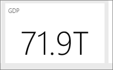

<properties
   pageTitle="設計絕佳的 Power BI 儀表板的秘訣"
   description="設計絕佳的 Power BI 儀表板的秘訣"
   services="powerbi"
   documentationCenter=""
   authors="mihart"
   manager="mblythe"
   backup=""
   editor=""
   tags=""
   qualityFocus="no"
   qualityDate=""/>

<tags
   ms.service="powerbi"
   ms.devlang="NA"
   ms.topic="article"
   ms.tgt_pltfrm="NA"
   ms.workload="powerbi"
   ms.date="08/11/2016"
   ms.author="mihart"/>

# 設計絕佳的 Power BI 儀表板的秘訣  

既然您已建立儀表板，並加入一些磚，思考如何讓您的儀表板不只是這樣，但是功能也。 一般情況下，所指的將最重要的資訊獨立，並讓全新而且整齊。

以下是一些秘訣。

### 請考慮您的對象  
什麼是重要的計量，可幫助他們做出決策？ 如何使用儀表板？ 學或文化特性的假設，可能會影響設計選擇？ 您的觀眾需要哪些資訊才會成功？

請記住，儀表板是概觀，從單一位置來監視資料的目前狀態。 儀表板根據基礎的報表和資料集，和那些可包含的詳細資料。 讀者可以鑽研儀表板的報表。 所以不要儀表板上放置的詳細資料，除非這是您的讀者需要監視。

其中儀表板會顯示？ 如果它是大型監視器上，您可以在其上將更多的內容。 如果讀取器將其平板電腦上檢視它，則較少的磚會更容易閱讀。

### 故事，並將它保存至一個畫面  
因為儀表板會顯示重要資訊一目了然，具有一個螢幕上的所有圖格是最佳的。 您可以避免捲軸上您的儀表板？

為儀表板得過於雜亂嗎？  移除所有重要的資訊，可以輕鬆地讀取和解譯。

### 請使用全螢幕模式
顯示儀表板中的 [全螢幕](powerbi-service-dash-and-reports-fullscreen.md) 沒有分散注意力的事情。

### 讓最大的最重要的資訊  
文字和儀表板上的視覺效果都是相同的大小，如果您的讀者會很難專注於是最重要的。 比方說，卡片視覺效果很適合用來以醒目的方式顯示重要的數字︰  

但請務必提供內容。  

閱讀有關 [建立並排顯示的數字](powerbi-service-create-a-big-number-tile-for-a-dashboard.md)。

### 將最重要的資訊放在右上角
大部分的人讀取從上到下，因此最高層級的頂端和顯示方向移動的對象的詳細使用讀取 （由左到右、 從右至左） 的詳細資料。

### 使用正確的視覺效果的資料並將其格式化以方便閱讀  
避免為了各種不同的視覺效果不同。  視覺效果應該繪製圖片，並能輕鬆地 「 讀取 」 和解譯。  簡單的圖形視覺效果的一些資料和視覺效果，即已足夠。 其他資料可能會呼叫，但更複雜的視覺效果中的請務必使用的標題和標籤，以及其他自訂，以協助讀者。  

- 
            [選擇適當的資料視覺效果](http://blogs.msdn.com/b/microsoft_business_intelligence1/archive/2012/10/08/best-practices-in-data-visualization.aspx)。 請務必小心使用扭曲實際上也就是 3d 圖表的圖表。 請記住，很難人腦解譯循環的圖形。 圓形圖、 甜甜圈圖表、 量測計和其他的循環的圖表類型看起來可能很但不是資料視覺效果最好。

- 在與圖表刻度在軸，圖表維度排序用維度值內圖表的色彩一致。

- 請務必好好編碼量化的資料。 顯示數字時，不超過三或四個的數字。 顯示量值的其中一或兩個字方小數點和小數位數數千或數百萬亦即 3.4 萬不 3,400,000。

- 請勿混合層級的有效位數和時間。 請確定會充分了解時間範圍。  沒有一個年度的某個特定月份的篩選圖表旁邊有上個月的圖表。

- 請勿混合使用大型與小型的量值，在相同的縮放比例，例如行或橫條圖上。  例如一個量值可以在數以百萬計和其他量值以千為單位。  這類大型調整時，它很難看到是以千為單位的量值的差異。  如果您需要混用，請選擇 [允許使用的第二個軸的視覺效果。

- 不會擾亂您不需要的資料標籤的圖表。 橫條圖中的值通常廣為人知而不會顯示實際數目。

- 請注意如何 [排序圖表](powerbi-service-change-how-a-chart-is-sorted.md)。  如果您想要強調的最高或最低數字，量值來排序。  如果您想要能夠快速找到特定的類別內其他許多類別的人，排序軸。  

- 圓形圖是最佳有八個類別。 因為您無法比較的值以並排方式，是很難比在圓形圖中的值的比較橫條圖和直條圖。 圓形圖將很檢視組件的整體的關聯性，而不是比較的組件。 和量測計圖非常適合用來在目標的內容中顯示的目前狀態。

多個特定視覺效果的指引，請參閱 [Power BI 中的視覺效果類型](powerbi-service-visualization-types-for-reports-and-q-and-a.md)。  

## 進一步了解最佳作法儀表板設計  
若要精通絕佳的儀表板設計的藝術，請考慮學習 visual 認知基本 Gestalt 原則以及如何以清楚地說明可採取動作內容中的資訊。 幸運的是，已有眾多的資源廣泛可用且執行我們的部落格內。 其中幾個我們最喜愛的書籍包括︰

- 
            *資訊的儀表板設計* Stephen 由幾個  
- 
            *顯示數字* Stephen 由幾個  
- 
            *現在您會看到它* Stephen 由幾個  
- 
            *構想資訊* Edward Tufte 的  
- 
            *進階簡報* Andrew Abela 所設計   

## 另請參閱  
[在 Power BI 儀表板](powerbi-service-dashboards.md)  
[Power BI-基本概念](powerbi-service-basic-concepts.md)  
更多的問題嗎？ [試用 Power BI 社群](http://community.powerbi.com/)
