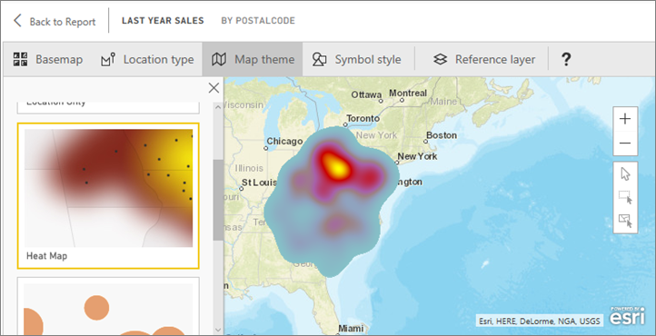
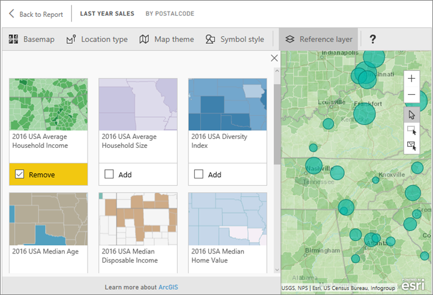
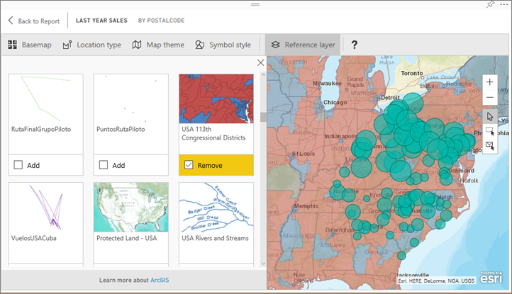
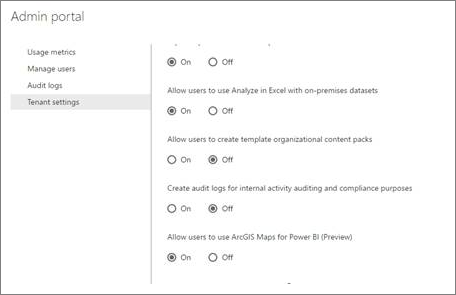

<properties
   pageTitle="在 Power BI 中的教學課程︰ ArcGIS"
   description="在 Power BI 中的教學課程︰ ArcGIS"
   services="powerbi"
   documentationCenter=""
   authors="mihart"
   manager="mblythe"
   backup=""
   editor=""
   tags=""
   featuredVideoId=""
   qualityFocus="no"
   qualityDate=""/>

<tags
   ms.service="powerbi"
   ms.devlang="NA"
   ms.topic="article"
   ms.tgt_pltfrm="NA"
   ms.workload="powerbi"
   ms.date="09/26/2016"
   ms.author="mihart"/>

# 在 Power BI （預覽） 中的教學課程︰ ArcGIS 對應

由 Power BI （預覽） 的 ArcGIS 對應 [Esri](https://www.Esri.com/powerbi) 地理區域可讓 Power BI。 ArcGIS 對應提供增強的對應功能、 人口統計資料，以及更多吸引人的地圖視覺效果，因此您可以告訴您最佳的故事。

## 使用者同意
Power BI 的 ArcGIS 對應由 [Esri](https://www.esri.com)。 您使用的 ArcGIS 對應 Power bi 是主體 Esri 的條款及隱私權原則。 Power BI 使用者想要使用 Power BI 視覺物件，需要 ArcGIS 對應接受同意對話方塊。

**資源**

[術語](https://go.microsoft.com/fwlink/?LinkID=826322)

[隱私權原則](https://go.microsoft.com/fwlink/?LinkID=826323)

[Power BI 產品頁面的 ArcGIS 對應](https://www.esri.com/powerbi)

## 啟用 ArcGIS 地圖預覽

ArcGIS 對應 visual 預覽中，並必須在 Power BI 中啟用。 本教學課程使用 [零售分析範例](powerbi-sample-retail-analysis-take-a-tour.md)。 為已啟用 **ArcGIS 對應 Power bi**:

1. 選取 **檔 > 選項和設定 > 選項 > 預覽功能**。

2. 選取 **ArcGIS 對應 Power bi** 核取方塊。 您必須重新啟動 Power BI 之後進行選擇。

    

3. 編輯檢視中開啟報表，Power BI 圖示 ArcGIS 對應從窗格中選取的視覺效果。

    

4. Power BI 顯示使用者同意對話方塊中，選取 **確定** 以繼續。

    

5. Power BI 報表畫布中加入空的 ArcGIS 對應範本。

    

## 建立 visual AcrGIS 對應
執行下列步驟來建立 **ArcGIS 對應 Power bi**。

1. 從 **欄位** ] 窗格中，拖曳資料欄位到 **位置** 或 **緯度** 和 **經度** 值區。

    >[AZURE.NOTE] Power BI 會自動偵測您所選取的欄位最適合檢視做為圖形或地圖上的點。 您可以調整設定 （請參閱下文） 中的預設值。

    

2.  從 **欄位** 窗格拖曳到量值 **大小** 或 **色彩** 調整資料顯示方式的值區。
   

## 設定和格式化 AcrGIS 地圖
若要存取 **ArcGIS 對應 Power bi** 格式化功能︰

1. 選取在焦點編輯視覺效果中的 [模式] 圖示。
   

2. 透過視覺效果中包含的功能區，存取其他功能。 每項功能，當選取此選項，開啟 [工作] 窗格提供詳細的選項。
   

   >  [AZURE.NOTE]  如需有關設定和功能的詳細資訊，請參閱 **詳細文件** 下方。

3. 若要返回報表，請選取 **回到報表** 從報表畫布的左上角。

## 詳細的文件

            **Esri** 提供 [完整文件](https://go.microsoft.com/fwlink/?LinkID=828772) 上的功能集 **ArcGIS 對應 Power bi**。

### 功能概觀

#### 基底的對應
提供四種基本的對應︰ 暗灰色畫布、 光線灰色畫布、 OpenStreetMap 和街道。  街道是 ArcGIS 的標準基本地圖。

若要套用基底對應選取它的工作窗格中。

#### 位置類型
Power bi ArgGIS 對應會自動偵測在地圖上顯示資料的最佳方式。 它會選取點或範圍。 位置類型選項可讓您微調這些選取項目。

            **界限** 將唯一的工作，如果您的資料包含標準地理的值。 Esri 自動找出要在地圖上顯示的形狀。 標準地理的值包括國家/地區、 省、 郵遞區號等。但就像使用地理編碼，Power BI 可能無法偵測的欄位應該會根據預設，界限，或可能沒有資料的範圍。  

#### 地圖主題
提供四個對應主題。 只有位置和大小的主題會自動選擇根據您繫結至的位置和大小值區，在 [欄位] 窗格中的欄位。 我們目前正在使用 **大小**, ，因此我們將變更為 **熱量分佈圖**。  

<table>
<tr><th>佈景主題</th><th>描述</th>
<tr>
<td>只有位置</td>
<td>繪製資料點或在 [位置類型設定為基礎的地圖上填滿的界限。</td>
</tr>
<tr>
<td>熱量分佈圖</td>
<td>繪製資料在地圖上的濃度繪圖。</td>
</tr>
<tr>
<td>大小</td>
<td>基礎地圖上的圖資料點，調整大小會根據大小值區中的欄位] 窗格中的值。</td>
</tr>
<tr>
<td>群集</td>
<td>繪製在地圖上的區域中的資料點的計數。 </td>
</tr>
</table>

#### 符號樣式
符號樣式可讓您微調如何呈現在地圖上的資料。 符號樣式會區分內容根據選取的位置類型和對應的主題。

### 參考圖層
####  參考圖層的人口統計資料
Power BI 的 ArcGIS 對應提供選取的人口統計的圖層，以協助 contextualize Power BI 中的資料。

1. 選取 **參考層** 索引標籤，然後選擇 [ **人口統計**。

2. 列出每個圖層都有一個核取方塊。 加入將該圖層加入至對應的核取記號。  在此範例中，我們已加入平均家庭收入。
   

2. 每個圖層也會是互動式。 就像您可以停留泡泡檢視的詳細資訊，您可以按一下以查看詳細資料地圖上的陰影的區域。
   

#### 參考圖層-ArcGIS
ArcGIS Online 可讓您的組織發行公用 web 對應。 此外，Esri 提供透過住 Atlas web 地圖策劃的組合。 在 ArcGIS] 索引標籤中，您可以搜尋所有的公用 web 對應或住 Atlas 對應，並將活動當做參考圖層加入至對應。

1. 選取 **參考層** 索引標籤，然後選擇 [ **ArcGIS**。

2. 輸入搜尋字詞，然後選取 [地圖圖層。 在此範例中我們選擇美國國會學區。

       
3. 詳細資訊，請選取灰色的區域，以開啟 _參考層選取_︰ 使用參考圖層上的選取範圍或物件選取參考圖層] 工具。

## 選取資料點
Power BI 的 ArcGIS 對應可讓三個的選取模式。

變更選取模式，使用參數︰

 選取個別資料點。

 在地圖上繪製的矩形，並選取包含的資料點。

 可讓界限或多邊形內參考圖層，以用來選取包含的資料點。

            **注意︰** 250 資料點最多可以選取一次。

## 取得說明

            **Esri** 提供 [完整文件](https://go.microsoft.com/fwlink/?LinkID=828772) 上的功能集 **ArcGIS 對應 Power bi**。

您可以詢問問題並且尋找解答 Power bi [社群執行緒相關 **ArcGIS 對應 Power bi**](https://go.microsoft.com/fwlink/?LinkID=828771) 來尋找最新的資訊或回報問題。

如果您有一大改進的建議，請將它們送出至 [Power BI 想法清單](https://ideas.powerbi.com)。

## 管理 ArcGIS 對應的 Power bi 您組織中使用

Power BI 可讓使用者、 租用戶系統管理員和 IT 系統管理員來管理是否要使用 Power BI ArcGIS 地圖。

            **使用者選項** 在 Power BI Desktop 中，使用者可以停止使用 Power bi 的 ArcGIS 對應選項中的 [安全性] 索引標籤上停用。 停用時，依預設將不會載入 ArcGIS 對應。

在 Power BI 服務中，使用者可以停止使用 Power bi 的 ArcGIS 對應 ArcGIS 的對應中的使用者設定的 Power BI （預覽）] 索引標籤上停用。 停用時，依預設將不會載入 ArcGIS 對應。

            **租用戶系統管理員選項** 在 PowerBI.com，租用戶系統管理員可以防止租用戶的所有使用者使用 Power bi ArcGIS 對應，藉由停用。 當發生這種情況時，Power BI 將不會再看見 ArcGIS 對應 Power BI 視覺效果] 窗格中的圖示。

            **IT 系統管理員選項** Power BI Desktop 支援使用 **群組原則** 停用 ArcGIS 對應整個組織的 Power BI 的部署電腦。

<table>
<tr><th>屬性</th><th>值</th>
</tr>
<tr>
<td>key</td>
<td>Software\Policies\Microsoft\Power BI 桌面</td>
</tr>
<tr>
<td>valueName</td>
<td>EnableArcGISMaps</td>
</tr>
</table>

值為 1 （十進位） 可讓 Power bi ArcGIS 的對應。

值為 0 （十進位） 停用 Power BI ArcGIS 對應。

您可以使用提供 **群組原則** 範本來快速新增必要的設定，以您 **群組原則**。

**範本**

[PowerBIEsri.adml](./groupPolicyTemplates/PowerBIEsri.adml)

[PowerBIEsri.admx](./groupPolicyTemplates/PowerBIEsri.admx)

## 常見問題
**有的 Power bi 使用 ArcGIS 對應任何費用嗎？**

ArcGIS 對應 Power bi （預覽） 可供所有 Power BI 使用者不需要額外成本。 它是一個元件所提供 **Esri** 受的條款及隱私權原則所提供貴用戶使用，而且 **Esri** 如本文稍早所述。

**Power BI 的 ArcGIS 對應是否支援 Esri 形狀檔？**

ArcGIS 對應 Power bi 會自動偵測國家/地區、 省/市和郵遞區號等的標準界限。 如果您需要提供自己的圖形還可以使用 [Power BI Desktop （預覽） 的圖形對應](powerbi-desktop-shape-map.md)。

**我可以連接至我的帳戶 ArcGIS 線上從 Power BI 嗎？**

尚未提供此服務。 
            [這個概念的投票](https://ideas.powerbi.com/forums/265200-power-bi-ideas/suggestions/9154765-arcgis-geodatabases ) ，我們會傳送一封電子郵件時我們開始進行這項功能。  

更多的問題嗎？ [試用 Power BI 社群](http://community.powerbi.com/)
