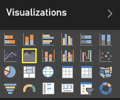

<properties
   pageTitle="教學課程︰ 基本區域圖"
   description="教學課程︰ 基本區域圖。"
   services="powerbi"
   documentationCenter=""
   authors="mihart"
   manager="mblythe"
   backup=""
   editor=""
   tags=""
   qualityFocus="no"
   qualityDate=""/>

<tags
   ms.service="powerbi"
   ms.devlang="NA"
   ms.topic="article"
   ms.tgt_pltfrm="NA"
   ms.workload="powerbi"
   ms.date="10/07/2016"
   ms.author="mihart"/>

# 教學課程︰ 基本區域圖  

基本的區域圖 （也稱為分層的區域圖表。） 為基礎的折線圖。 軸和線條之間的區域是填滿色彩來表示磁碟區。 

區域圖強調的範圍隨著時間變更，而且可用來強調跨趨勢的總計值。 比方說，收益代表一段時間的資料可繪製在區域圖強調總收益。

## 當使用基本的區域圖  
基本的區域圖是相當好的選擇︰

-   查看，並在時間序列比較的磁碟區的趨勢 

-   代表實體可計算的個別數列設定

## 建立基本的區域圖表  
要跟著做，請登入 Power BI，然後選取 **取得資料 \> 範例 \> 零售分析範例**。 

1.  「 零售分析範例 」 儀表板中，選取 **總商店** 磚以開啟 「 零售分析範例 」 報告。

2.  選取 **編輯報表** 編輯檢視中開啟報表。

3.  加入新的報表頁面。

4.  建立依月份顯示本年度銷售量與去年的銷售區域圖。

    a.  從 **欄位] 窗格**, ，請選取 **銷售 \> Last Year Sales**, ，和 **This Year Sales > 值**。

    b。  將圖表轉換成基本區域圖。    
    

    c.  選取 **時間 \> 月** 將它加入至 **軸** 良好。   
    

    d.  依月份顯示圖表，請選擇省略符號 （視覺效果的右上角），並選擇 **依照月份排序**。

## 反白顯示和交叉篩選  
使用 [篩選] 窗格的相關資訊，請參閱 [將篩選加入至報表](powerbi-service-add-a-filter-to-a-report.md)。

若要選取一個區域，按一下該區域內或頂端對齊。  基本的區域圖不交叉篩選 [報表] 頁面上的其他視覺效果。 不過，區域圖是交叉篩選 [報表] 頁面上的其他視覺效果所觸發的目標。

## 秘訣和訣竅基本區域圖  
-   沒有適用於比較的值，因為在多層式區域阻擋基本區域圖。 Power BI 會使用透明度指出的重疊的區域。 不過，它僅適用於兩個或三個不同的區域。 當您需要比較了三個以上的量值的趨勢時，請嘗試使用折線圖。 當您需要比較了三個以上的量值的磁碟區時，請嘗試使用 treemap。

## 請參閱  
[在 Power BI 中的報表](powerbi-service-reports.md)  
[Power BI 報表中的視覺效果](powerbi-service-visualizations-for-reports.md)  
[Power BI-基本概念](powerbi-service-basic-concepts.md)  
更多的問題嗎？ [試用 Power BI 社群](http://community.powerbi.com/)
