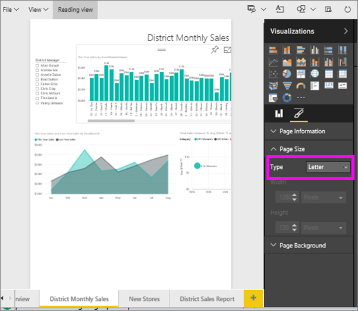
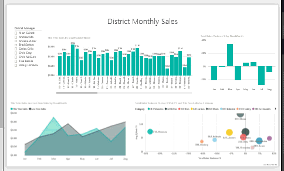
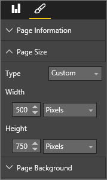
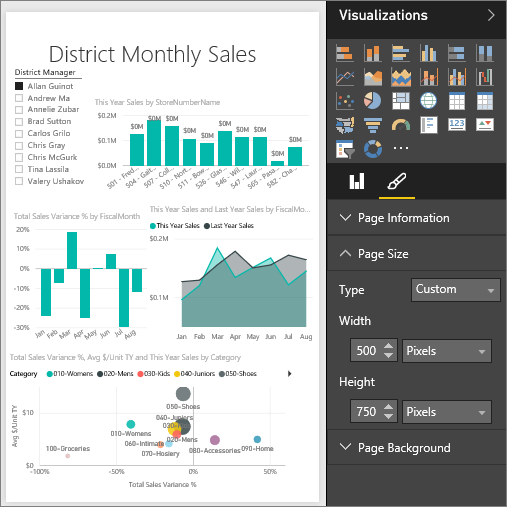

<properties
   pageTitle="教學課程︰ 變更顯示設定頁面的 Power BI 報表"
   description="教學課程︰ 變更顯示設定頁面的 Power BI 報表"
   services="powerbi"
   documentationCenter=""
   authors="mihart"
   manager="mblythe"
   backup=""
   editor=""
   tags=""
   qualityFocus="modifying"
   qualityDate=""/>

<tags
   ms.service="powerbi"
   ms.devlang="NA"
   ms.topic="article"
   ms.tgt_pltfrm="NA"
   ms.workload="powerbi"
   ms.date="08/15/2016"
   ms.author="mihart"/>

# 教學課程︰ 變更顯示設定頁面的 Power BI 報表

在 [前一篇文章和影片](powerbi-service-change-report-display-settings.md) 您學到兩個不同的方式來控制頁面顯示在 Power BI 報表︰ **檢視** 和 **頁面大小**。 現在讓我們來試試看自己。

## 首先，讓我們變更此頁面的檢視設定

1.  在 [編輯] 檢視中開啟報表。 這個範例會使用 「 新增存放區 」 頁面的 [零售分析範例](powerbi-sample-retail-analysis-take-a-tour.md)。  根據預設，頁面會顯示使用 **大小** 設定。  在此情況下，調整成] 頁面會顯示不含捲軸，[報表] 頁面，但有些詳細資料以及標題是太小，無法讀取。

    

2.  請確定在畫布上，會選取任何視覺效果。 選取 **檢視** 並檢閱顯示的選項。

    

3.  讓我們來看看頁面外觀使用 **實際大小** 設定。

    

    太棒了，儀表板現在有雙重捲軸。

4.  切換至 **適合寬度**。

    

   看起來更好，我們現在已捲軸，但很容易閱讀詳細資料。

## 變更報表頁面的預設檢視

所有 Power BI 報告皆預設為 **大小** 檢視。 但如果您想要在開啟此報表頁面 **實際大小** 檢視？

1.  在 **新的存放區** 頁面的報表中，切換回 **實際大小** 檢視。

    

2.  選取將報表儲存到不同名稱 **檔案 > 將儲存為**。 您現在有 2 份這份報表。在原始報表中， **新的存放區** 開啟的預設檢視中，但它會在開啟的新報表中將繼續 **實際大小** 檢視。 我們，請參閱。

    

3.  返回 **零售分析範例** 瀏覽窗格中選取的儀表板。 向下捲動至 **報表** 區段，並尋找新的報表 （會有黃色星號）。  

    

4.  選取要開啟它，然後選擇報表 **新的存放區** 頁面。 它會在開啟 **實際大小** 檢視 ！

    

## 現在，讓我們來探索 *頁面大小* 設定

1.  開啟 「 地區每月銷售量 」 頁面的 [零售分析範例](powerbi-sample-retail-analysis-take-a-tour.md) 編輯檢視中。

2.  請確定在畫布上，會選取任何視覺效果。  在 **視覺效果** ] 窗格中，選取 [小畫家] 圖示 。

3.  選取 **頁面大小** &gt; **類型** 要顯示的頁面大小選項。

    

4.  選取 **字母**。  在畫布上，放入 816 x 1056 像素 （Letter 大小） 內的內容保持在畫布上的白色部分。

    

5.  如果我們變更 **檢視** "符合以寬度，「 我們畫布現在只顯示頁面的內容納入 letter 大小。

    

6.  選取 **16:9** 頁面比率。

    

    [報表] 頁面會顯示使用 9 高 16 寬度的比率。 若要查看所使用的實際像素大小，請看一下灰色的寬度和高度欄位 (1280 x 720)。 有很多空白周圍的空間報表畫布中。這是因為先前設定 **檢視** "最適寬度 」。

7.  繼續探索 **頁面大小** 選項。

## 同時使用頁面檢視和頁面大小

若要建立內嵌在另一個應用程式時的最佳報表一起使用頁面檢視和頁面大小。

在此練習中，您將建立的應用程式擁有 500 像素寬 750 個像素高的空間，將會顯示報表頁面。

請記住上一個步驟中，我們所見，我們的報表頁面目前顯示在 1280 寬 720 高。 讓我們知道，我們需要進行大量的調整大小和重新排列如果我們想要所有我們的視覺效果來調整。

1. 調整大小並移動視覺效果，使其可以放在小於目前的畫布的一半。

    

2. 選取 **頁面大小** &gt; **自訂**。

3. 設為 500 的寬度和高度] 設為 750。

    

4. 調整 [報表] 頁面上，使它看起來最好。 切換 **檢視 > 實際大小** 和 **檢視 > 大小** 進行調整。

    

## 請參閱

            [建立 Cortana 的報告](powerbi-service-cortana-desktop-entity-cards.md) 回到 [頁面 Power BI 報表中顯示設定](powerbi-service-change-report-display-settings.md) 深入了解  [電源 B 中的報表 ](powerbi-service-reports.md)
[Power BI-基本概念](powerbi-service-basic-concepts.md) 更多的問題嗎？ [試用 Power BI 社群](http://community.powerbi.com/)
