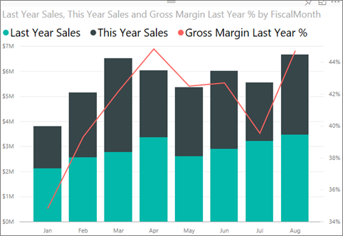
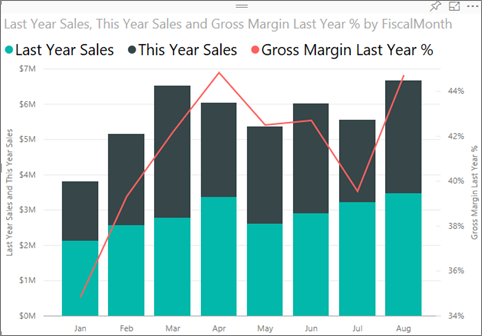

<properties
   pageTitle="教學課程︰ 在 Power BI 中的組合圖"
   description="本文件為教學課程 （視訊），說明為什麼以及如何在 Power BI 中建立組合式圖表。"
   services="powerbi"
   documentationCenter=""
   authors="mihart"
   manager="mblythe"
   backup=""
   editor=""
   tags=""
   featuredVideoId="lnv66cTZ5ho"
   qualityFocus="monitoring"
   qualityDate=""/>

<tags
   ms.service="powerbi"
   ms.devlang="NA"
   ms.topic="article"
   ms.tgt_pltfrm="NA"
   ms.workload="powerbi"
   ms.date="08/29/2016"
   ms.author="mihart"/>
# 教學課程︰ 在 Power BI 中的組合圖

在 Power BI 中組合式圖表會結合線圖和直條圖的單一視覺效果。 您將 2 圖表結合成一個可讓進行更快速的資料比較。

組合圖表可以有一或兩個 Y 軸。

## 何時使用組合圖

組合圖表是相當好的選擇︰

-   當您擁有折線圖及具有相同 X 軸的直條圖。

-   要比較具有不同的值範圍的多個量值。

-   為了說明一種視覺效果中的兩個量值之間的相互關聯。

-   若要檢查是否一個量值符合另一個量值所定義的目標

-   若要保留畫布空間。

## 建立基本的單一軸，組合圖

監看式將建立使用銷售和行銷範例組合式圖表。

<iframe width="560" height="315" src="https://www.youtube.com/embed/lnv66cTZ5ho?list=PL1N57mwBHtN0JFoKSR0n-tBkUJHeMP2cP" frameborder="0" allowfullscreen></iframe>

若要建立您自己的組合式圖表，請登入 Power BI，然後選取 **取得資料 \> 範例 \> 零售分析範例**。 

1. 「 零售分析範例 」 儀表板中，選取 **總商店** 磚以開啟 「 零售分析範例 」 報告。

2. 選取 **編輯報表** 編輯檢視中開啟報表。

3. 
            [加入新的報表頁面](powerbi-service-add-a-page-to-a-report.md)。

4. 建立依月份顯示本年度的銷售和毛利邊界的直條圖。

    a.  從 [欄位] 窗格中，選取 **銷售** \> **本年度銷售額** > **值**。

    b。  拖放到 **銷售** \> **Gross Margin 此年** 至 **值** 良好。

    c.  選取 **時間** \> **FiscalMonth** 將它加入至 **軸** 良好。 

    

5. 將直條圖轉換為組合式圖表。 選取此選項，直條圖與從 **視覺效果** 窗格選取 **行與群組的直條圖**。

    

7.  從 **欄位** 窗格拖曳 **銷售** \> **Last Year Sales** 至 **列值** 值區。

    

    組合式圖表看起來應該像這樣︰

    

## 建立具有兩個軸組合圖

在這個工作中，我們會比較毛利率與銷售。

1.  建立新的折線圖曲目毛利率 %最後一年。  一月 GM %35%，在 4 月尖峰 45 %7 月份卸除並 8 月一次的尖峰。 我們會看到類似的模式，在去年和本年度的銷售嗎？

    

2.  新增 **This Year Sales > 值** 和 **Last Year Sales** 至折線圖。 小數位數 **GM %去年** 是遠小於的小數位數 **銷售** 因此比較不容易。      

    

3.  若要讓您更輕鬆地讀取和轉譯視覺效果，將轉換成線條和堆疊直條圖的折線圖。

    

4.  拖放到 **毛利率 %去年** 從 **資料行值** 到 **行值**。 Power BI 會建立兩個座標軸，因此可允許資料集，以調整會有所不同。左邊測量金額和正確的量值的百分比。

        

## 將標題加入至這兩個軸

1.  選取向下箭頭以展開 **y 軸** 選項。

2.   **y 軸 （資料行）**, ，請將 **位置** 來 **左**, ，請將 **標題** 到 **上**, ，**樣式** 至  **顯示標題只**, ，和 **顯示** 做為 **數以百萬計**。

    

4.  在 **y 軸 （資料行）** 也確保 **顯示次要** 設為 **上**。 這會顯示格式化組合式圖表的線條圖部分的選項。

    

5.   **y 軸 （列）**, ，保留 **位置** 為 **右邊**, ，開啟 **標題** 到 **上**, ，並設定 **樣式** 至 **顯示標題只**。

    組合式圖表現在會顯示雙重座標軸，兩者皆擁有項目。

    

從這裡，您可能想要︰

-  
            [做為儀表板] 的磚加入組合式圖表](powerbi-service-dashboard-tiles.md)。

-  
            [將報表儲存](powerbi-service-save-a-report.md)。

## 反白顯示和交叉篩選

使用 [篩選] 窗格的相關資訊，請參閱 [將篩選加入至報表](powerbi-service-add-a-filter-to-a-report.md)。

反白顯示的資料行或組合圖表中的列交叉篩選...在報表頁面上的其他視覺效果，反之亦然。

## 請參閱

[報表中加入視覺效果](https://powerbi.uservoice.com/knowledgebase/articles/441777)

[Power BI 報表中的視覺效果](powerbi-service-visualizations-for-reports.md)

[在 Power BI 中的視覺效果類型](powerbi-service-visualization-types-for-reports-and-q-and-a.md)

[Power BI-基本概念](powerbi-service-basic-concepts.md)

[試試看-它的免費 ！](https://powerbi.com/)

更多的問題嗎？ [試用 Power BI 社群](http://community.powerbi.com/)
