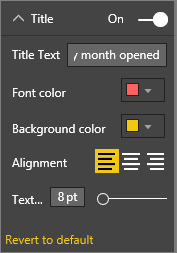
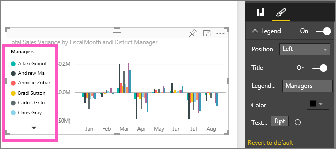

<properties
   pageTitle="教學課程︰ 自訂 visual 標題、 圖例和背景。 "
   description="教學課程︰ 自訂視覺效果標題、 背景和圖例"
   services="powerbi"
   documentationCenter=""
   authors="mihart"
   manager="mblythe"
   backup=""
   editor=""
   tags=""
   qualityFocus="monitoring"
   qualityDate=""/>

<tags
   ms.service="powerbi"
   ms.devlang="NA"
   ms.topic="article"
   ms.tgt_pltfrm="NA"
   ms.workload="powerbi"
   ms.date="10/01/2016"
   ms.author="mihart"/>

# 教學課程︰ 自訂視覺效果標題、 背景和圖例

在本教學課程中，您將學習許多不同的方式，以自訂視覺效果。 並非所有視覺效果可自訂， [查看完整清單](#list)。  具體來說，本教學課程涵蓋了自訂︰  
-   視覺化項目  
-   視覺效果的背景  
-   視覺效果的圖例

## 自訂報表中的視覺化項目    
已登入 Power BI 服務，我開始和零售分析範例報表 [編輯檢視](powerbi-service-interact-with-a-report-in-editing-view.md)。 如果要跟著做， [連接到零售分析範例](powerbi-sample-downloads.md)。

>[AZURE.NOTE]  
>當您釘選視覺效果的儀表板時，它會變成儀表板] 磚。  磚本身也可以自訂與 [新的標題和子字幕、 超連結、 調整大小和](powerbi-service-edit-a-tile-in-a-dashboard.md)。

1.  瀏覽至報表的 「 新增存放區 」 頁面，然後選取 [開啟存放區計數所開啟的月份] 直條圖。

2.  在 [視覺效果和篩選] 窗格中，選取 [小畫家圖示  的格式化選項，然後選取 **標題** 以展開該區段。  
    

3.  開啟  **標題** 開啟和關閉選取 On （或關閉） 滑動軸。 現在，讓它 **上**。  
    

4.  變更 **標題文字** 輸入 **依月份開啟儲存計數** 文字欄位中。  

5.  變更 **字型色彩** 橙色和 **背景色彩** 為黃色。

    -   選取下拉式清單中，選擇的色彩 **佈景主題色彩**, ，**最近使用的色彩**, ，或 **自訂色彩**。

    -   選取下拉式清單中，以關閉 [色彩] 視窗。  
    

    您隨時可以回復預設色彩選取 **還原為預設值** [色彩] 視窗中。

6.  最後我們要在圖表標題的自訂是對齊中央的視覺效果。 標題位置預設為靠左對齊。  

    在此教學課程中，直條圖點 **標題** 應該看起來像這樣︰  
    

    若要還原到目前為止，我們所做的所有標題自訂，請選取 **都還原至預設**, ，底部 **標題** 自訂] 窗格中。  
    

## 自訂視覺效果的背景  
選取的相同資料行圖表，展開 [背景] 選項。

1.  選取 [On （或關閉） 開啟和關閉背景滑桿。 現在，讓它 **上**。

2.  將背景色彩變更為 74%灰色。

    -   選取下拉式清單中，選擇 [灰色的色彩 **佈景主題色彩**, ，**最近使用的色彩**, ，或 **自訂色彩**。

    -    將透明度變更為 74%。   
    

    若要還原到目前為止，我們所做的所有標題背景自訂，請選取 **都還原至預設**, ，底部 **背景** 自訂] 窗格中。

## 自訂視覺效果的圖例  

1. 開啟 **概觀** 報告頁面，然後選取 「 總銷售額變異數的 FiscalMonth 和學區管理員 」 圖表。

2. 視覺效果] 索引標籤中選取小畫家圖示以開啟 [格式] 窗格。  

3. 展開 **圖例** 選項。

      

3.  選取 [On （或關閉） 開啟圖例開啟和關閉滑桿。 現在，讓它 **上**。

4.  將圖例移到左邊算起的視覺效果。    

3.  加入圖例標題切換 **標題** 到 **上** 並在 **圖例名稱** 欄位中，輸入 **管理員**。
    

    若要還原到目前為止，我們所做的所有圖例自訂，請選取 **都還原至預設**, ，底部 **圖例** 自訂] 窗格中。

## 您可以自訂的視覺效果類型  
| 視覺效果  | 標題  | 背景 | 圖例 |
|:---------------|:-------|:-----------|:-------|
| 區域           | 是    | 是        | 是    |
| bar            | 是    | 是        | 是    |
| 卡片           | 是    | 是        | n/a    |
| 多個資料列卡 | 是    | 是        | n/a    |
| 資料行         | 是    | 是        | 是    |
| 組合          | 是    | 是        | 是    |
| 甜甜圈          | 是    | 是        | 是    |
| 布的圖     | 是    | 是        | 是    |
| 漏斗圖         | 是    | 是        | n/a    |
| 量測計          | 是    | 是        | n/a    |
| kpi            | 是    | 是        | n/a    |
| line           | 是    | 是        | 是    |
| map            | 是    | 是        | 是    |
| 矩陣         | 是    | 是        | n/a    |
| 圓形圖            | 是    | 是        | 是    |
| 散佈圖        | 是    | 是        | 是    |
| 交叉分析篩選器         | 是    | 是        | n/a    |
| table          | 是    | 是        | n/a    |
| 文字方塊        | 否     | 是        | n/a    |
| treemap        | 是    | 是        | 是    |
| 瀑布      | 是    | 是        | 是    |

## 請參閱  
進一步了解 [Power BI 報表中的視覺效果](powerbi-service-visualizations-for-reports.md)  
[自訂 x 軸和 y 軸](powerbi-service-tutorial-customize-x-axis-and-y-axis-properties.md)  
[自訂色彩和軸屬性](powerbi-service-getting-started-with-color-formatting-and-axis-properties.md)  
[Power BI-基本概念](powerbi-service-basic-concepts.md)  
更多的問題嗎？ [試用 Power BI 社群](http://community.powerbi.com/)
