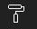
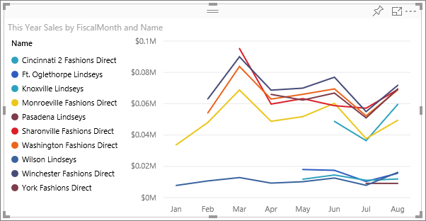
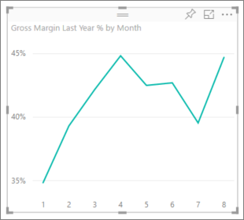

<properties
   pageTitle="教學課程︰ 自訂 x 軸和 y 軸屬性"
   description="教學課程︰ 自訂 x 軸和 y 軸屬性"
   services="powerbi"
   documentationCenter=""
   authors="mihart"
   manager="mblythe"
   backup=""
   editor=""
   tags=""
   qualityFocus="monitoring"
   qualityDate="05/23/2016"/>

<tags
   ms.service="powerbi"
   ms.devlang="NA"
   ms.topic="article"
   ms.tgt_pltfrm="NA"
   ms.workload="powerbi"
   ms.date="10/08/2016"
   ms.author="mihart"/>
# 教學課程︰ 自訂 x 軸和 y 軸屬性

在本教學課程中，您將學習許多不同的方式，以自訂的 x 軸和 y 軸的視覺效果。 並非所有視覺效果有座標軸或您可以自訂。例如，圓餅圖沒有軸。 而且自訂選項不同 visual，以一篇文章涵蓋太多的選項。 因此，我們將探討一些最常用的軸的自訂項目，您習慣使用取得 visual 的格式設定] 索引標籤在 Power BI 報表畫布中。  

>[AZURE.NOTE] 此頁面適用於 Power BI 服務和 Power BI Desktop。 這些自訂項目，當 **格式** (小畫家滾筒圖示  ) 已選取，也可用於 Power BI Desktop。  

## 自訂報表中的視覺效果 X-axes

登入 Power BI 服務，並開啟 **零售分析範例** 回報 [編輯檢視](powerbi-service-interact-with-a-report-in-editing-view.md)。 如果要跟著做， [連接到零售分析範例](powerbi-sample-downloads.md)。

1.  建立新的直條圖會顯示本年度的銷售和會計月份的最後一年的銷售額。 

2. 將它轉換至堆疊直條圖。

3.  在視覺效果和篩選] 窗格中，選取 **格式** (小畫家滾輪圖示  ) 以顯示自訂選項。

4.  展開的 x 軸選項。

5.  藉由選取 [On （或關閉） 開啟和關閉 x 軸滑桿。 現在，讓它 **上**。  關閉 x 軸會移除 x 軸標籤，並將儲存空間更多資料。

    

6.  開啟 [x 軸標題 **上** ，並在此情況下，顯示在 X 軸-名稱 **FiscalMonth**。  

    之後這些自訂，直條圖應該看起來像這樣︰

     

    >[AZURE.NOTE] 如果報表擁有者為日期類型，分類在 x 軸 **類型** 選項將會顯示，且您可以選擇連續或類別。 

若要還原到目前為止完成的所有 x 軸自訂，請選取 **還原至預設 **底部 **x 軸** 自訂] 窗格中。

## 自訂報表中的視覺效果 y 軸

某些視覺效果有 y 軸，也可以自訂。 有有雙重的 y 軸，即使有些視覺效果，您將學習如何以及自訂的。

1.  從 **新增存放區** ] 索引標籤的零售分析範例報表中，選取圖表 」 按 FiscalMonth 本年度銷售額 」。

    

2. 從 [欄位] 窗格中，選取 **存放區** > **名稱** 加入它做為 **圖例**。

    

3.  在視覺效果和篩選] 窗格中，選取 **格式** （小畫家滾輪圖示。
     ) 以顯示自訂選項。

4. 展開 [y 軸選項，並確定在 y 軸的滑桿就切換為 **上**。

     

4.  開啟標題 **上** ，讓同事可以看到在摘要在測量什麼。 並設定 **樣式** 至 **顯示標題** **只** (而不是 **顯示兩者** 或 **只顯示單位**) 因為 y 軸已經顯示的度量單位是美金。

3.  變更到 y 軸位置 **右邊** 移動圖例遠離且更容易讀取。

4.  變更以顯示較高的銷售量與公司的開始和結束範圍。

    -   若要設定開始 **35,000**

    -   結束設定為 **100000**

6.  這些自訂之後, 您折線圖應該看起來像這樣︰

    

    若要還原到目前為止完成的所有 y 軸自訂，請選取 **還原至預設**, ，底部 **y 軸** 自訂] 窗格中。

## 使用雙重 y 軸的自訂視覺效果

首先您要建立其中探討了影響存放區計數對銷售組合式圖表。  這是相同的圖表中建立 [組合式圖表教學課程](powerbi-service-tutorial-combo-chart-merge-visualizations.md)。 然後，您將格式化雙重 y 軸。

### 建立含有兩條 y 軸的圖表

1.  建立新的折線圖，追蹤 **Sales > 毛利率過去年度 %** 由 **時間 > 月**。 

2. 選取省略符號 （...），選擇排序月份的視覺效果 **依照月份排序**

    

3. 一月 GM %35%，在 4 月尖峰 45 %7 月份卸除並 8 月一次的尖峰。 我們會看到類似的模式，在去年和本年度的銷售嗎？

4.  新增 **This Year Sales > 值** 和 **Last Year Sales** 至折線圖。 小數位數 **GM %去年** 是遠小於的小數位數 **銷售** 因此比較不容易。      

    

5.  若要讓您更輕鬆地讀取和轉譯視覺效果，將轉換成線條和堆疊直條圖的折線圖。

    

4.  拖放到 **毛利率過去年度 %** 從 **資料行值** 到 **行值**。 Power BI 會建立兩個座標軸，因此可允許資料集，以調整會有所不同。左邊測量金額和正確的量值的百分比。

    

  
### 設定次要 y 軸的格式

1.  在 **視覺效果** 窗格中，選取小畫家滾輪圖示，以顯示 [格式化選項。

2.  藉由選取向下箭號展開 y 軸選項。

3.  捲動清單，直到您找到的選項 **顯示次要**。 切換 **顯示次要** 從 **關閉** 到 **上**。

    

    

4.  （選擇性）自訂兩個軸。 如果您切換 **位置** 資料行軸或列軸，然後兩個軸切換邊。

    

### 將標題加入至兩個座標軸

有視覺效果，這變得複雜，就能加入軸標題。  標題幫助您了解的本文告訴您視覺效果的同事。

1.  切換 **標題** 到 **上** 的 **y 軸 （資料行）** 和 **y 軸 （列）**。

2.  設定 **樣式** 至 **顯示標題只**。

    

3.  組合式圖表現在會顯示雙重座標軸，兩者皆擁有項目。

    

如需詳細資訊，請參閱 [秘訣和訣竅色彩格式設定、 標記、 和軸屬性](powerbi-service-tips-and-tricks-for-color-formatting.md)。

## 請參閱

進一步了解 [Power BI 報表中的視覺效果](powerbi-service-visualizations-for-reports.md)

            [自訂 t](powerbi-service-tutorial-customize-visualization-title-background-and-legend.md)[itles，背景和圖例](powerbi-service-tutorial-customize-visualization-title-background-and-legend.md)

[自訂色彩和軸屬性](powerbi-service-getting-started-with-color-formatting-and-axis-properties.md)

[Power BI-基本概念](powerbi-service-basic-concepts.md)

更多的問題嗎？ [試用 Power BI 社群](http://community.powerbi.com/)
