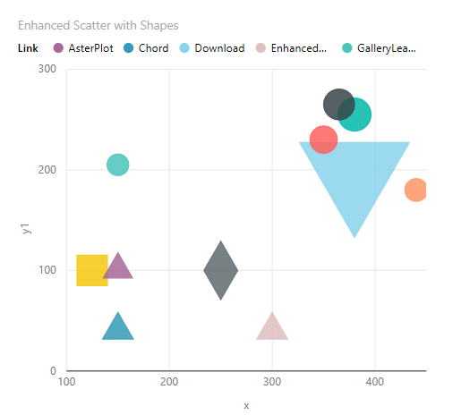
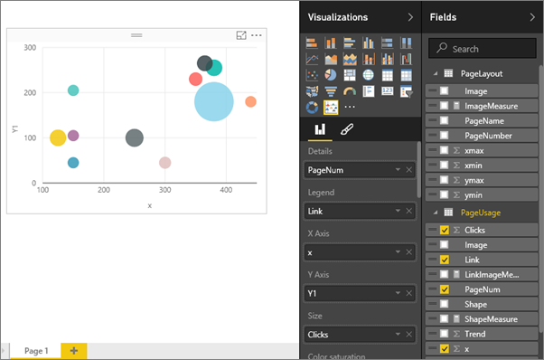
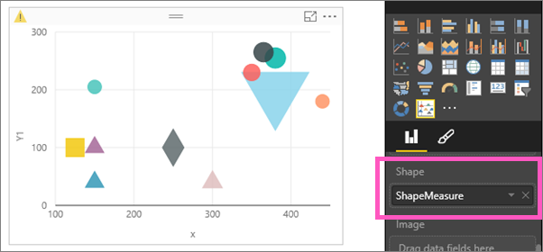
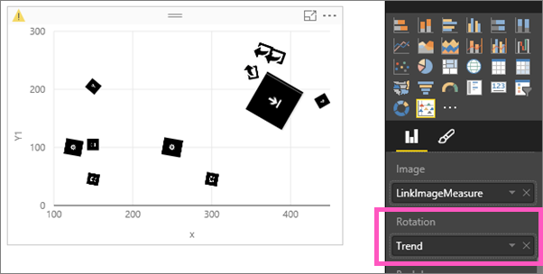
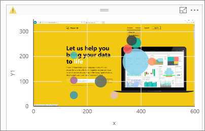

<properties
   pageTitle="教學課程︰ 增強 Power BI 中的散佈圖"
   description="教學課程︰ 增強 Power BI 中的散佈圖。"
   services="powerbi"
   documentationCenter=""
   authors="mihart"
   manager="mblythe"
   backup=""
   editor=""
   tags=""
   qualityFocus="no"
   qualityDate=""/>

<tags
   ms.service="powerbi"
   ms.devlang="NA"
   ms.topic="article"
   ms.tgt_pltfrm="NA"
   ms.workload="powerbi"
   ms.date="08/11/2016"
   ms.author="mihart"/>

# 教學課程︰ 增強 Power BI 中的散佈圖

增強的散佈圖只是 Microsoft 建立自訂視覺效果可從下載 [Power BI 視覺效果庫](https://app.powerbi.com/visuals)。  增強的散佈圖是類似標準的散佈圖或泡泡圖，在於它會顯示 2 到 3 變數之間的關聯性。 差別您並不限於圓形 （泡泡）。 您可以顯示圖案，映像、 將影像加入至背景，以及其他等等。

如需詳細資訊，請觀看這段影片中有關 [增強散佈](https://youtu.be/xCfM0cjM4do?list=PL1N57mwBHtN1vIjfvuBIzZllrmKo-Vz6x)。

下列步驟說明一個方法可用於增強的散佈圖-建立視覺效果對應的數量和位置，在網頁上的網頁點選次數。 使用您自己的資料集，並了解更多的方法使用這個新的自訂視覺效果。

>[AZURE.NOTE] 不幸的是，在本教學課程使用的資料集不是可供下載。

## 開始建立基本的泡泡圖

泡泡圖會顯示網站的流量詳細資料。

1. 在 [編輯] 檢視中開啟報表，並加入空白頁。

2. 選取散佈圖圖示，空的散佈圖加入至畫布。

3. 從 [欄位] 窗格中，選取 **Page Usage** \> **PageNum** 將它加入至  **詳細資料**。

4. 選取 **連結**, ，然後 **x** 和 **Y1** 那些連結的座標。 確保將 Power BI **連結** 至 **圖例**, ，**x** 至 **X 軸**, ，和 **Y1** 至 **Y 軸**。

5. 最後，加入 **按一下** 至 **大小**。

      

我建立了典型的泡泡圖。 接下來的步驟示範增強散佈的進階的功能。  

## 增強的散佈圖圖表轉換成泡泡圖

1. 
            [下載增強的散佈視覺化](powerbi-custom-visuals-download-from-the-gallery.md) 和 [加入報表](powerbi-custom-visuals-add-to-report.md)。

2. 如果您收到訊息，詢問您要啟用自訂視覺效果，請閱讀該警告，然後選取 **啟用自訂視覺效果**。

3. 選取泡泡圖，並將它轉換成增強的散佈圖中，選取增強的散佈圖圖示     從 **視覺效果** 窗格。

    

  此時，圖表看起來應該完全相同。  如果不存在，請參閱 [視覺效果中的欄位值區的核取並未變更。  如果有，移回其原始值區。  例如，如果 **Y1** 從移 **Y 軸** 至 **大小**, ，移回 **Y 軸**, 等等。

## 新增圖形、 影像、 旋轉和背景

增強的散佈圖組件即使到單一的視覺效果的詳細資訊。 在以下步驟，新增圖形、 影像、 旋轉和背景。

>[AZURE.IMPORTANT]  這些視覺效果的欄位都需要您將量值的資料集，傳回文字值。 如果您的資料行包含的圖形名稱或影像的 Url，則您需要建立量值傳回第一個非空白資料列 （或任何其他邏輯，會傳回一個文字值，用於此視覺效果的欄位值區）。

1. 新增圖形以視覺化方式識別連結的類型︰ 下載，深入了解定價、 首頁、 等等。拖放到 **ShapeMeasure** 至 **圖形**。  Power BI 可讓︰ 圓形、 交叉、 菱形、 正方形、 三角形向上、 三角形清單中，星號六邊形，x 向上箭號，並向下箭號。 這些值必須已存在於 （或加入至） 您的資料集。

    

    請確定您的同事，知道每個圖形所代表的意義。  您可以將文字方塊加入至報表。  或者，使用通常都可辨識的圖形。

2. 移除 **ShapeMeasure** 從 **圖形** 區域和拖放到 **LinkImageMeasure** 至 **映像**。

    

3. 若要以圖形方式溝通更多的資訊，請將 **趨勢** 至 **旋轉**。  每個影像旋轉會指出是否按下的次數趨勢向上或向下。

    

4. 若要讓這張圖表更容易閱讀，加入實際的網頁的映像做為背景。  在此範例中，我們只要新增一個影像，但顯示的量值會控制哪些網頁。
移除 **LinkImageMeasure** 拖曳 **PageLayout** > **ImageMeasure** 至 **背景**。

    

5. 使用 xmin、 xmax、 ymin 和 ymax 區域背景影像對齊 x 和 y 座標，用來繪製此資料。
  - 拖曳 **xmin** 至 **X 開始**。
  - 拖曳 **xmax** 至 **X 結束**。
  - 拖曳 **ymin** 至 **Y 開始**
  - 拖曳 **ymax** 至 **Y 結束**

    

## 加入交叉分析篩選器

右現在，這個視覺效果並不怎麼有用因為顯示總到單一網頁映像的所有 3 個網頁的按一下動作。  加入的交叉分析篩選器來控制要顯示的網頁 （和資料）。

1. 選取交叉分析篩選器] 圖示，將交叉分析篩選器加入至報表畫布的空白區域 。

2. 選取 **PageName** 將它加入至 **欄位** 區域。

    

    

3. 配量顯示增強的散佈圖中，按一下 [每個網頁-一次的資料。

    

    

    

## 請參閱

[在 Power BI 中的報表](powerbi-service-reports.md)

[在 Power BI 中的視覺效果類型](powerbi-service-visualization-types-for-reports-and-q-and-a.md)

[Power BI 報表中的視覺效果](powerbi-service-visualizations-for-reports.md)

[Power BI-基本概念](powerbi-service-basic-concepts.md)

更多的問題嗎？ [試用 Power BI 社群](http://community.powerbi.com/)
