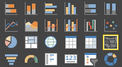
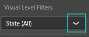
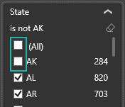
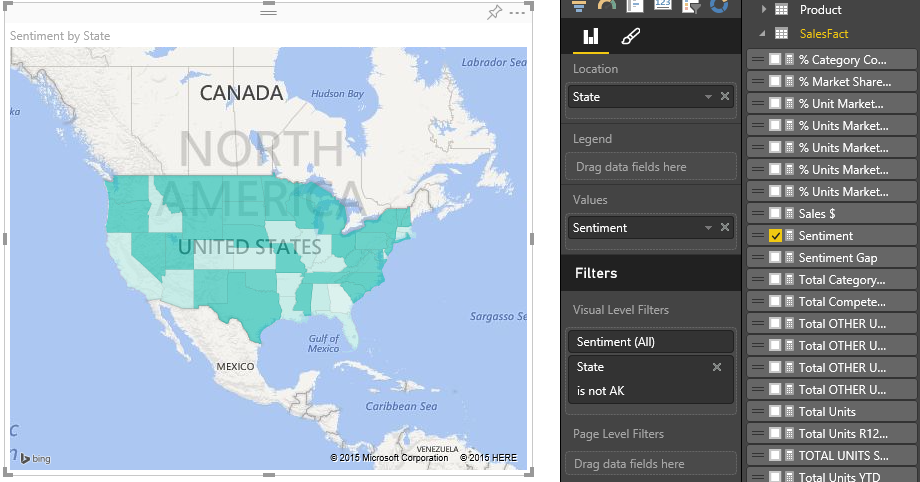
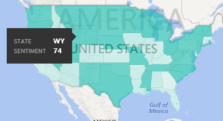

<properties
   pageTitle="教學課程︰ 填滿的對應 (Choropleths)，在 Power BI 中"
   description="文件-教學課程，說明建立 Power BI 中的填入對應 (Choropleths)"
   services="powerbi"
   documentationCenter=""
   authors="mihart"
   manager="mblythe"
   backup=""
   editor=""
   tags=""
   featuredVideoId="ajTPGNpthcg"
   qualityFocus="no"
   qualityDate=""/>

<tags
   ms.service="powerbi"
   ms.devlang="NA"
   ms.topic="article"
   ms.tgt_pltfrm="NA"
   ms.workload="powerbi"
   ms.date="08/23/2016"
   ms.author="mihart"/>

# 教學課程︰ 填滿 Power BI 中的對應 (choropleths)  

分布的圖使用顯示比例值不同地理位置或地區如何網底或濃淡或模式。  快速顯示陰影，範圍從 light （較不頻繁的/較低） 使用這些相對差異暗色調 （更頻繁的/多個）。    

## 何時使用分布的圖  
填滿的對應是相當好的選擇︰

-   若要在地圖上顯示數量的資訊。

-   若要顯示空間模式和關聯性。

-   當您的資料已經過標準化。

-   當使用社會的資料。

-   當定義的區域是重要的。

-   若要取得跨地理位置的分佈的概觀。

## 建立基本的布的圖
在這段影片中，Kim 建立基本地圖，並將它轉換為分布圖。

<iframe width="560" height="315" src="https://www.youtube.com/embed/ajTPGNpthcg" frameborder="0" allowfullscreen></iframe>

若要建立您自己的填滿的對應， [下載銷售和行銷範例](powerbi-sample-downloads.md) 登入 Power BI，然後選取 **取得資料 \> 檔案 \> 本機檔案 \> 銷售與行銷**。

1.  開啟 [空白報表頁面 ](powerbi-service-add-a-page-to-a-report.md) 中 [編輯檢視](powerbi-service-interact-with-a-report-in-editing-view.md) 銷售與行銷 」 範例資料集  

2.  選取 **地理** \> **狀態** 欄位。    

3.  
            [將圖表轉換](powerbi-service-change-the-type-of-visualization-in-a-report.md) 填滿的對應。 請注意， **狀態** 現在處於 **位置** 良好。 Bing 地圖服務會使用中的欄位 **位置** 也用來建立對應。  此位置可以是不同的有效位置︰ 國家/地區、 狀態、 郡、 城市、 郵遞區號或其他郵遞區號等等。Bing 地圖在世界各地提供填滿的圖形。 沒有位置 1-mb 有效的項目，Power BI 無法建立填滿的對應。  

4.  篩選地圖來顯示只有美國大陸。

    a.  在 [視覺效果] 窗格的底部，尋找 **篩選** 區域。

    b。  將滑鼠停留在 **狀態** 和展開 > 形箭號  
    

    c.  旁放置一個核取記號 **所有** 並移除旁邊的核取記號 **AK**。

    

5.  選取 **SalesFact** \> **情緒** 將它加入至 **值** 良好。 中的欄位 **值** 也可控制地圖的陰影。  

6.  布的圖是藍色，代表較低的情感數字的淺藍色與深藍色表示更高版本，更正值情感變暗。  此處我反白為止 Wyoming (WY) 和情感是很好，請參閱狀態 74。  

7.  
            [填滿的地圖加入做為儀表板] 的磚 (pin 視覺效果)](powerbi-service-dashboard-tiles.md)。 

8.  
            [將報表儲存](powerbi-service-save-a-report.md)。

## 反白顯示和交叉篩選  
使用 [篩選] 窗格的相關資訊，請參閱 [將篩選加入至報表](powerbi-service-add-a-filter-to-a-report.md)。

反白顯示填滿的對應中的位置交叉篩選...在報表頁面上的其他視覺效果，反之亦然。

1.  在填滿地圖上，選取狀態。  這會反白顯示在頁面上的其他視覺效果。 選取 **德州**, ，比方說，顯示我情感是 74，德州位於中央學區 \#23，且大部分的銷售量來自仲裁及便利性的區段。   
    

2.  在折線圖上切換 **否** 和 **是**。 這會篩選填滿地圖來顯示情緒 VanArsdel 和 VanArsdel 的競賽。  
    

## 疑難排解  
地圖資料可能是模稜兩可。  例如，沒有巴黎，法國，但是巴黎汀也存在。 您的地理資料可能會儲存在個別的資料行 – 縣 （市） 名稱的資料行、 縣市或鄉鎮名稱、 等 – 的資料行，所以 Bing 可能無法判斷哪個是會在巴黎。 如果您的資料集已經包含經度和緯度資料，Power BI 會有特殊欄位，讓地圖資料的模稜兩可。 只要拖曳欄位，其中包含緯度資料視覺效果 \> 緯度區域。  並對經度資料執行相同的。  
 

如果您有權限可編輯 Power BI Desktop 中的資料集，觀看這段影片中定址對應模稜兩可的說明。

<iframe width="560" height="315" src="https://www.youtube.com/embed/Co2z9b-s_yM" frameborder="0" allowfullscreen></iframe>

如果您沒有存取經度和緯度資料 [遵循這些指示來更新您的資料集](https://support.office.com/article/Maps-in-Power-View-8A9B2AF3-A055-4131-A327-85CC835271F7)。

如需有關地圖視覺效果，請參閱 [秘訣和訣竅地圖視覺效果](powerbi-service-tips-and-tricks-for-power-bi-map-visualizations)。

## 請參閱  
 [報表中加入視覺效果](https://powerbi.uservoice.com/knowledgebase/articles/441777)  

             [在 Power BI 中的視覺效果類型](powerbi-service-visualization-types-for-reports-and-q-and-a.md)
 [變更視覺效果所使用的型別](powerbi-service-change-the-type-of-visualization-in-a-report.md)
 [釘選視覺效果的儀表板](powerbi-service-pin-a-tile-to-a-dashboard-from-a-report.md)  
 [Power BI-基本概念](powerbi-service-basic-concepts.md)  
[試試看-它的免費 ！](https://powerbi.com/)  
更多的問題嗎？ [試用 Power BI 社群](http://community.powerbi.com/)
