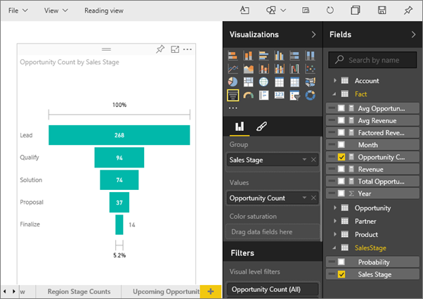
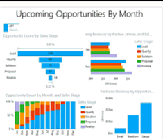
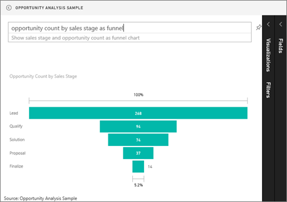

<properties
   pageTitle="教學課程︰ 漏斗 Power BI 中的圖表"
   description="教學課程︰ 漏斗 Power BI 中的圖表"
   services="powerbi"
   documentationCenter=""
   authors="mihart"
   manager="mblythe"
   backup=""
   editor=""
   tags=""
   featuredVideoId="maTzOJSRB3g"
   qualityFocus="no"
   qualityDate=""/>

<tags
   ms.service="powerbi"
   ms.devlang="NA"
   ms.topic="article"
   ms.tgt_pltfrm="NA"
   ms.workload="powerbi"
   ms.date="10/07/2016"
   ms.author="mihart"/>
# 教學課程︰ 漏斗 Power BI 中的圖表

漏斗圖可協助您以視覺化方式檢視有連續的連線的階段線性程序。 例如，追蹤客戶的各個階段銷售漏斗︰ 導致 \> 限定導致 \> 潛在 \> 合約 \> 關閉。  您一眼的漏斗形狀傳達正在追蹤的程序的健全狀況。

漏斗圖的每個階段代表總計的百分比。 因此，在大部分情況下，漏斗圖形狀類似漏斗-第一階段的最大、 與每個後續的階段小於其前身產品。  Pear 形漏斗圖也很有用，--它可以找出處理序中的問題。  但是，第一個階段，「 攝取 」 階段中，通常是最大值。

## 何時使用漏斗圖

漏斗圖是相當好的選擇︰

-   當資料是循序的而且至少 4 個階段中移動。

-   當 「 項目 」 中的第一個階段的數目預計要大於數中的最後階段。

-   若要計算階段可能 （營收/sales/處理/等等）。

-   計算並追蹤轉換及保留率。

-   若要顯示線性程序中的瓶頸。

-   若要追蹤的購物車 」 工作流程。

-   若要追蹤進度和成功的點選連結廣告/行銷活動。

## 使用漏斗圖表
漏斗圖︰

-   可釘選的報表，以及從問與答。

-   您可以排序。

-   支援倍數。

-   可以是反白顯示和交叉篩選由相同的報表頁面上的其他視覺效果。

-   可用來反白顯示和交叉篩選在相同的報表] 頁面上的其他視覺效果。

## 建立基本的漏斗圖

這個影片會建立漏斗圖使用銷售和行銷範例。

<iframe width="560" height="315" src="https://www.youtube.com/embed/maTzOJSRB3g" frameborder="0" allowfullscreen></iframe>

現在建立您自己漏斗圖會顯示在每個我們的銷售階段我們有的機會數目。

這些指示使用機會追蹤範例。 如果要跟著做， [範例下載](powerbi-sample-downloads.md), ，登入 Power BI，然後選取 **取得資料 \> 範例 \> 機會分析範例 \> 連接**。

1. 開啟 [空白報表頁面 ](powerbi-service-add-a-page-to-a-report.md)中 [編輯檢視](powerbi-service-interact-with-a-report-in-editing-view.md) ，然後選取 **SalesStage** \> **銷售階段** 欄位。  

    

2. 
            [將圖表轉換](powerbi-service-change-the-type-of-visualization-in-a-report.md) 漏斗。 請注意， **銷售階段** 處於 **群組** 良好。 

3. 從 **欄位** 窗格中，選取 **事實** \> **商機計數**。

    

4. 滑鼠游標停留於列顯示的資訊。

    -   階段的名稱

    -   在這個階段中目前的機會的數目

    -   整體的轉換比率 （負責人 %） 

    -   --階段 （也稱為卸除率） 也就是前一個階段 （在此情況下，提案階段/方案階段） 的 %

    

5. 
            [做為儀表板] 的磚加入漏斗](powerbi-service-dashboard-tiles.md)。 

6. 
            [將報表儲存](powerbi-service-save-a-report.md)。

## 反白顯示和交叉篩選

使用 [篩選] 窗格的相關資訊，請參閱 [將篩選加入至報表](powerbi-service-add-a-filter-to-a-report.md)。

反白顯示一條分隔線漏斗交叉篩選...在報表頁面上的其他視覺效果，反之亦然。 若要跟著做，加入包含漏斗圖 [報表] 頁面中的少數的多個視覺效果。

1.  在漏斗圖中，選取 **提案** 列。 這個跨-反白顯示在頁面上的其他視覺效果。 

    

    >[AZURE.TIP]  使用多重選取的 ctrl 鍵。 

2.  在 「 分解營收的商機 」 圖表中，反白顯示 **大** 列交叉篩選] 頁面上，包括漏斗圖上的其他視覺效果。

3. 若要設定如何視覺效果跨反白顯示和交叉篩選彼此的喜好設定，請參閱 [Power BI 中的視覺化互動](powerbi-service-visual-interactions.md)

## 建立漏斗圖在問與答

反白顯示已釘選 」 機會追蹤 」 資料集至少一個視覺效果的儀表板。  當您輸入問與答問題時，Power BI 搜尋中相關聯的所有資料集的答案 （具有磚釘選到） 選取的儀表板。 如需詳細資訊，請參閱 [Power BI-基本概念](powerbi-service-basic-concepts.md)。

1.  反白顯示具有至少一個 tile 機會追蹤集中釘選儀表板。

2.   開始在問與答問題方塊中輸入您的問題。

    

    務必讓 Power BI 知道哪一個視覺效果 」 做為漏斗 」 新增您想使用的型別。

## 請參閱

[報表中加入視覺效果](powerbi-custom-visuals-add-to-report.md)

[在 Power BI 中的視覺效果類型](powerbi-service-visualization-types-for-reports-and-q-and-a.md)

[釘選視覺效果的儀表板](powerbi-service-pin-a-tile-to-a-dashboard-from-a-report.md)

[Power BI-基本概念](powerbi-service-basic-concepts.md)

更多的問題嗎？ [試用 Power BI 社群](http://community.powerbi.com/)
