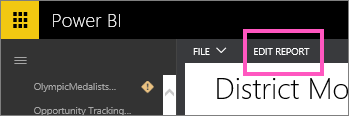
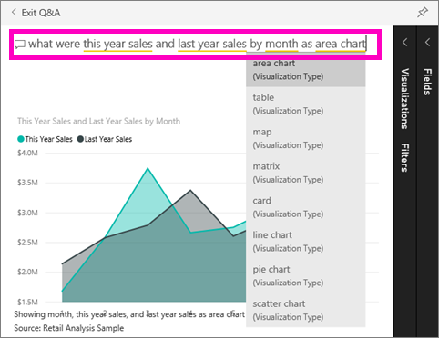

<properties
   pageTitle="教學課程︰ 開始使用 Power BI 問與答"
   description="教學課程︰ 開始使用 Power BI 問與答零售分析範例"
   services="powerbi"
   documentationCenter=""
   authors="mihart"
   manager="mblythe"
   backup=""
   editor=""
   tags=""
   qualityFocus="monitoring"
   qualityDate=""/>

<tags
   ms.service="powerbi"
   ms.devlang="NA"
   ms.topic="article"
   ms.tgt_pltfrm="NA"
   ms.workload="powerbi"
   ms.date="10/05/2016"
   ms.author="mihart"/>
# 零售分析範例與教學課程︰ 使用 Power BI 問與答

有時候獲得解答，從您的資料最快的方法是使用自然語言詢問問題。  在本教學課程中我們將探討建立相同的視覺效果的 2 個不同的方式︰ 建置在報表中，並詢問問題問與答。  

## 方法 1︰ 使用報表編輯器
1. 從 Power BI 工作區中，選取 **取得資料** \> **範例** \> **零售分析範例** > **連接**。

    

2. 儀表板包含區域圖磚 「 最後一個年度銷售額與本年度銷售量 」。  選取此方塊。 

    -   建立這張牌的問答集，如果選取方塊將會開啟問與答。 

    -   但是，報表會開啟至包含此視覺效果的頁面在報表中，建立這張牌。

3. 在 [編輯] 檢視中開啟報表，藉由選取 **編輯報表**。

    

4. 選取區域圖，並檢閱在設定 **欄位** 窗格。  報表建立者這張圖表中選取建置的 3 個值 (**時間 > FiscalMonth**, ，**銷售 > 本年度銷售額**, ，**銷售 > Last Year Sales > 值**) 並將它們在組織 **軸** 和 **值** 改良。

    

## 方法 2︰ 使用問與答
我們如何呢建立使用問與答此相同折線圖？
    

1.  瀏覽回到您是零售分析範例儀表板。

2.  使用自然語言時，輸入類似下面的 [問題]:

    **依區域圖顯示的月份是今年銷售量與去年銷售**

    當您輸入您的問題，問與答挑選最佳的視覺效果，以顯示您的答案。和視覺效果動態變更當您修改這個問題。 此外，問與答幫助您格式化您一些建議，自動完成和拼字修正的問題。

    當您完成輸入您的問題時，則結果會是完全相同的圖表，我們看到在報表中。  但此方法建立更快速 ！

    

4. 類似於處理報表，問與答內您可以存取 [視覺效果、 篩選和欄位] 窗格。  開啟這些窗格，以進一步探索和修改 visual studio。

3.  若要釘選到儀表板的圖表，請選取 [釘選圖示 。

## 請參閱

[問與答時可提出的問題類型？](powerbi-service-q-and-a.md)

[問與答 Power BI 中](powerbi-service-q-and-a.md)

[讓您有效搭配問與答 Power BI 中的資料](powerbi-service-make-your-data-work-well-with-q-and-a.md)

[活頁簿準備問與答](powerbi-service-make-your-data-work-well-with-q-and-a.md)

更多的問題嗎？ [試用 Power BI 社群](http://community.powerbi.com/)
