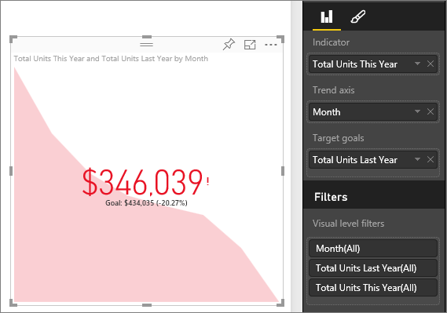

<properties
   pageTitle="KPI 的視覺效果"
   description="在 power bi 中建立 KPI"
   services="powerbi"
   documentationCenter=""
   authors="mihart"
   manager="mblythe"
   backup=""
   editor=""
   tags=""
   featuredVideoId="xmja6EpqaO0"
   qualityFocus="no"
   qualityDate=""/>

<tags
   ms.service="powerbi"
   ms.devlang="NA"
   ms.topic="article"
   ms.tgt_pltfrm="NA"
   ms.workload="powerbi"
   ms.date="08/23/2016"
   ms.author="mihart"/>

# 在 Power BI 中的 Kpi

關鍵效能指標 (KPI) 是進度的視覺提示，通訊可測量目標數量。 如需 Kpi 的詳細資訊，請參閱 [Microsoft Developer Network](https://msdn.microsoft.com/library/hh272050)。

##  使用 KPI 的時機
Kpi 是相當好的選擇︰

-   要測量的進度 (什麼我直接讀取或事後上？)

-   來測量目標的距離 (距離前進還是背後上午我？)   

##  KPI visual 需求
關鍵效能指標 (KPI) 根據特定量值，設計來協助您評估目前值和標準，以針對定義目標的狀態。 因此，需要 KPI visual *基底* 評估為值的量值和 *目標* 量值或值，以及臨界值或目標。

>[AZURE.NOTE] 目前，KPI 資料集必須包含 KPI 目標值。 這可以由目標的 excel 工作表加入至資料模型或 PBIX 檔。

##  如何建立 KPI  

要跟著做，請登入 Power BI，然後選取 **取得資料 > 範例 > 零售分析範例**。 我們將建立測量的進度，我們已經達成業務目標的 KPI。

或監看式將說明如何建立單一度量的視覺效果︰ 量測計、 卡和 Kpi。
<iframe width="560" height="315" src="https://www.youtube.com/embed/xmja6EpqaO0?list=PL1N57mwBHtN0JFoKSR0n-tBkUJHeMP2cP" frameborder="0" allowfullscreen></iframe>

1.  選取 **Sales > 本年度的總單位**。  這會是指標。

2.  新增 **時間 > 月**。  如此將會顯示趨勢。

2. 從 [視覺效果] 窗格中選取的 KPI 圖示，將視覺效果轉換至 KPI。

    

3. 新增目標。 加入最後一年銷售做為目標。 拖放到 **總單位去年** 至 **目標目標** 欄位。

    

4.  （選擇性） 選取 [小畫家] 圖示以開啟 [格式] 窗格來格式化 KPI。

    -   
            **指標** -控制指標的顯示單位和小數位數。

    -   
            **趨勢軸** -當設定為 **上**, ，趨勢軸會顯示為 KPI 的視覺效果的背景。  

    -   
            **目標** -當設定為 **上**, ，視覺效果以百分比顯示的目標和目標之間的距離。

    -   
            **狀態** -某些 Kpi 會被視為 *更好* 的較高值和部分會被視為 *更好* 的較低的值。 例如，盈餘 VS。 等待時間。 通常與較高值的等候時間 – 通常被視為更糟的是較佳的收入較高的值。 此切換可讓您選取的 KPI 行為。 狀態選項預設為 **高最好**。

6.  當您希望您有了 KPI [它釘選到儀表板](powerbi-service-pin-a-tile-to-a-dashboard-from-a-report.md)。

Kpi 也是可用的行動裝置 – 讓您永遠連線到您的企業活動訊號

##  請參閱

[在 Power BI 中的報表](powerbi-service-reports.md)

[Power BI 報表中的視覺效果](powerbi-service-visualizations-for-reports.md)

[Power BI-基本概念](powerbi-service-basic-concepts.md)

更多的問題嗎？ [試用 Power BI 社群](http://community.powerbi.com/)
