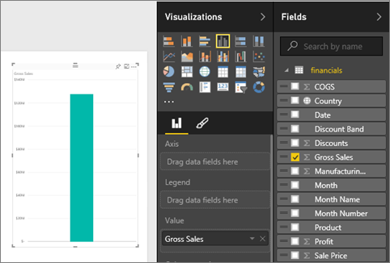
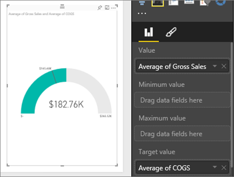
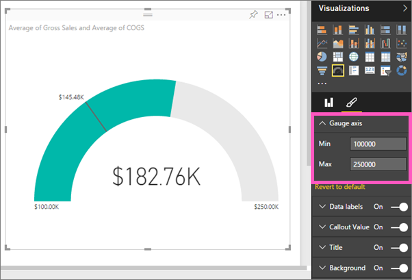

<properties
   pageTitle="在 Power BI 中的教學課程︰ 星形量測計圖表"
   description="在 Power BI 中的教學課程︰ 星形量測計圖表"
   services="powerbi"
   documentationCenter=""
   authors="mihart"
   manager="mblythe"
   backup=""
   editor=""
   tags=""
   featuredVideoId="xmja6Epqa"
   qualityFocus="no"
   qualityDate=""/>

<tags
   ms.service="powerbi"
   ms.devlang="NA"
   ms.topic="article"
   ms.tgt_pltfrm="NA"
   ms.workload="powerbi"
   ms.date="08/22/2016"
   ms.author="mihart"/>

# 在 Power BI 中的教學課程︰ 星形量測計圖表

星形量測計圖表擁有圓弧，而且會顯示單一值，測量到的目標/KPI 的進度。  目標或目標值會以列 （指針）。 以陰影表示該目標的進度。  和，進度會顯示表示粗體弧線內的值。 所有可能的值都平均分散沿著弧形，從最小值 （最左邊的值） 為最大值 （最右邊的值）。

在下列範例中，我們是汽車零售商，追蹤每個月的銷售團隊的平均銷售額。 我們的目標是 140 和黑色的指針所表示。  最小可能的平均銷售量是 0，且我們已將最大值設定為 200。  藍色陰影顯示，我們正在目前銷售量加以平均大約 120 本月份。 幸運的是，我們仍有另一個週達成目標的時間。

## 使用星形量測計的時機

星形量測計是相當好的選擇來︰

-   顯示進度達成目標。

-   代表百分位數的量值，例如 KPI。

-   顯示單一量值的健全狀況。

-   必須快速掃描和了解的顯示資訊。

## 建立基本的星形量測計

這些指示使用 「 財務 」 範例。 如果要跟著做， [下載範例](http://go.microsoft.com/fwlink/?LinkID=521962) 到您的電腦登入 Power BI 並選取 **取得資料 \> 檔案 \>  本機檔案 > 開啟**。 

或監看式將說明如何建立單一度量的視覺效果︰ 量測計、 卡和 Kpi。
<iframe width="560" height="315" src="https://www.youtube.com/embed/xmja6EpqaO0?list=PL1N57mwBHtN0JFoKSR0n-tBkUJHeMP2cP" frameborder="0" allowfullscreen></iframe>

### 步驟 1︰ 開啟財務範例 Excel 檔案。

1.  在 Power BI 中開啟檔案，藉由選取 **取得資料 \> 檔案** 並瀏覽至您儲存檔案的位置。 選取 **匯入**。 財務範例會加入至您的工作區中，做為資料集。

2.  選取 **財務範例** 在瀏覽模式中開啟它。

### 步驟 2︰ 建立追蹤的銷售毛額的量測計

1.  在 **欄位** 窗格中，選取 **銷售毛額**。

    

2.  變更的彙總 **平均**。

    

3.  選取量測計圖示  轉量測計的直條圖。

  根據預設，Power BI 會建立量測計圖表，其中假設目前的值 （在此案例中，平均的銷售毛額） 是量測計的中間點。 因為 $182 平均銷售毛額。 76 K 開始值 （最少） 設定為 0 和結束值 （最多） 設定為目前的值加倍。

  

### 步驟 3︰ 設定目標值

1. 拖放到 **COGS** 至 **目標值** 良好。

2.  變更的彙總 **平均**。
  Power BI 將代表我們的目標值的指針 **$145。 48 K**。 請注意，我們已經超過我們的目標。

    

    >[AZURE.NOTE] 您可以手動輸入目標值。  下面，請參閱 「 使用格式化選項，以手動方式設定最小值、 最大值和目標值 」。

### 步驟 4︰ 設定最大值

在步驟 2，Power BI 會使用 [值] 欄位會自動設定 [最小 （開始） 和最大 （結束）。  但是，如果您要設定您自己的最大值？  比方說，而不是使用兩倍的目前值做為最大可能值，您想要將它設定為最高的銷售毛額號碼在您的資料集嗎？ 

2.  拖放到 **的銷售毛額** 從 **欄位** 清單 **最大值** 良好。

2.  變更的彙總 **最大**。

    

    量測計會以新的結束值，在 gross 1.21 萬個銷售重新繪製。

### 步驟 5︰ 儲存報表

6.  
            [將報表儲存](powerbi-service-save-a-report.md)。

7. 
            [做為儀表板] 的磚加入量測計圖表](powerbi-service-dashboard-tiles.md)。 

## 使用格式選項來手動設定最小值、 最大值和目標值

1. 移除 **最大的銷售毛額** 從 **最大值** 良好。

2.  選取 [小畫家] 圖示，以開啟 [格式] 窗格。

    

2. 展開 **量測計軸** 輸入值 **Min** 和 **Max**。

    

3. 移除目前的目標值，藉由移除旁邊的核取記號 **COGS**。

    

4. 當 **目標** 欄位之下 **量測計軸**, ，輸入的值。

    

5. （選擇性） 繼續格式化量測計圖表。

## 請參閱

[在 Power BI 中的報表](powerbi-service-reports.md)

[在 Power BI 中的視覺效果類型](powerbi-service-visualization-types-for-reports-and-q-and-a.md)

[報表中加入視覺效果](https://powerbi.uservoice.com/knowledgebase/articles/441777)

[釘選視覺效果的儀表板](powerbi-service-pin-a-tile-to-a-dashboard-from-a-report.md)

[ Power BI-基本概念](powerbi-service-basic-concepts.md)

更多的問題嗎？ [試用 Power BI 社群](http://community.powerbi.com/)
