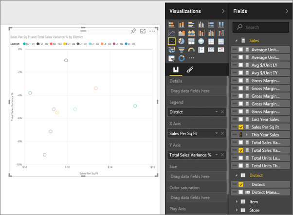

<properties
   pageTitle="教學課程︰ 散佈在 Power BI 中的圖"
   description="教學課程︰ 散佈在 Power BI 中的圖"
   services="powerbi"
   documentationCenter=""
   authors="mihart"
   manager="mblythe"
   backup=""
   editor=""
   tags=""
   featuredVideoId="PVcfPoVE3Ys"
   qualityFocus="no"
   qualityDate=""/>

<tags
   ms.service="powerbi"
   ms.devlang="NA"
   ms.topic="article"
   ms.tgt_pltfrm="NA"
   ms.workload="powerbi"
   ms.date="08/29/2016"
   ms.author="mihart"/>

# 教學課程︰ 散佈圖和泡泡圖，在 Power BI 中  

散佈圖一定會有兩個值座標軸，顯示一組數字資料沿著水平軸和另一組數值沿著垂直軸的值。 此圖表顯示點交集處的 x 和 y 數值，這些結合成單一資料點值。 這些資料點可能平均或不易散佈在水平軸，視資料而定。

泡泡圖會將資料點取代反昇，泡泡與 *大小* 代表其他維度的資料。

## 何時使用散佈圖或泡泡圖

### 散佈圖是相當好的選擇︰

-  若要顯示 （散佈圖） 2 或 3 （泡泡） 之間的關聯性 **數值** 值。

-  若要繪製成一系列的 xy 座標的兩個數字群組。

-  而不是折線圖，當您想要變更水平軸的縮放比例    

- 若要水平軸變成對數刻度。

- 若要顯示的工作表包含組或分組的資料集值。 在散佈圖中，您可以調整獨立的縮放比例的軸，以顯示群組值的詳細資訊。

- 若要顯示模式中大量的資料，例如，以顯示線性或非線性趨勢、 叢集和極端值。

- 要比較大量資料點，而不考慮時間和您在散佈圖中包含的資料越多圖表，越好，可讓您比較。

### 泡泡圖是相當好的選擇︰

- 如果您的資料有 3 個資料數列，每個包含一組值。

- 呈現的財務資料。  不同的泡泡大小適合以視覺化方式強調特定值。

- 若要使用象限。

## 建立散佈圖

<iframe width="560" height="315" src="https://www.youtube.com/embed/PVcfPoVE3Ys?list=PL1N57mwBHtN0JFoKSR0n-tBkUJHeMP2cP" frameborder="0" allowfullscreen></iframe>

1.  開啟中的零售分析範例 [編輯檢視](powerbi-service-interact-with-a-report-in-editing-view.md) 和 [新增新的報表頁面](powerbi-service-add-a-page-to-a-report.md)。

2. 從 [欄位] 窗格中，選取 **銷售** > **銷售每個 Sql 全文檢索** 和 **銷售** > **總銷售額差異 %**。

3. 從 [欄位] 窗格中，選取 **學區 > 學區**。

    

4. 將轉換成散佈圖。 在視覺效果] 窗格中，選取 [散佈圖圖示。
 。

5. 拖放到 **學區** 從 **詳細資料** 到 **圖例**。

    

我們現在有繪製總銷售額的變異數 %y 軸，沿著 X 軸繪製平方英尺每個銷售的散佈圖。  資料點色彩代表學區。  現在讓我們將新增第三個維度。

## 建立泡泡圖

1.  從 [欄位] 窗格中，拖曳 **銷售** > **本年度銷售額** > **值** 至 **大小** 區域。 

    

2. 暫留在泡泡圖。  泡泡的大小會反映值 **本年度銷售額**。

    

3. （選擇性） [格式化視覺效果色彩、 標籤、 標題、 背景等等](powerbi-service-getting-started-with-color-formatting-and-axis-properties.md)。

## 疑難排解

### **散佈圖有一個資料點**  

散佈圖有只有一個資料點的 X 和 Y 軸上的所有值彙總嗎？  或者，也許彙總單一水平或垂直對齊的所有值？

加入欄位以 **詳細資料** 告訴 Power BI 如何將值分組的區域。 欄位必須是唯一的每個您想要繪製的點。  

* 例如簡單的資料列數目或 ID 欄位︰

    

* 或者，如果您不需要的資料中，您可以建立您的 X 和 Y 值串連成每個點唯一的欄位︰   

   使用 [查詢編輯器] 中，將索引資料行新增至您的資料集。  然後加入本專欄 **詳細資料** 您視覺效果的區域。

  如需詳細資訊，請參閱 [報表中的彙總](powerbi-service-aggregates.md)。

## 請參閱  
 [報表中加入視覺效果](powerbi-service-add-visualizations-to-a-report-i.md)  

 [在 Power BI 中的視覺效果類型](powerbi-service-visualization-types-for-reports-and-q-and-a.md)

 [Power BI-基本概念](powerbi-service-basic-concepts.md)  

[試試看-它的免費 ！](https://powerbi.com/)  

更多的問題嗎？ [試用 Power BI 社群](http://community.powerbi.com/)
