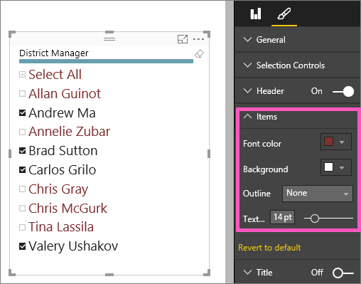
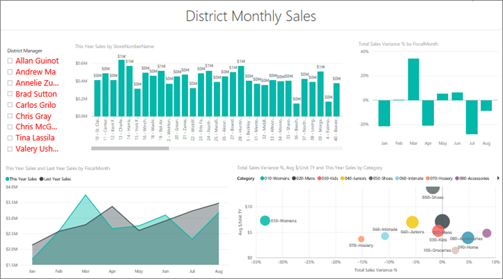

<properties
   pageTitle="在 Power BI 中的教學課程︰ 交叉分析篩選器"
   description="在 Power BI 中的教學課程︰ 交叉分析篩選器"
   services="powerbi"
   documentationCenter=""
   authors="mihart"
   manager="mblythe"
   backup=""
   editor=""
   tags=""
   featuredVideoId="7rrvpa6KUto"
   qualityFocus="monitoring"
   qualityDate=""/>

<tags
   ms.service="powerbi"
   ms.devlang="NA"
   ms.topic="article"
   ms.tgt_pltfrm="NA"
   ms.workload="powerbi"
   ms.date="10/08/2016"
   ms.author="mihart"/>

# 在 Power BI 中的教學課程︰ 交叉分析篩選器  

您銷售副總裁希望能查看的度量，整個部門和每個個別的學區管理員的數目。 她可以為每個管理員，建立個別的報表頁面上，或者她可以使用交叉分析篩選器。 交叉分析篩選器會縮小頁面上的其他視覺效果中顯示的資料集的部分。  交叉分析篩選器篩選的替代方式。

    

## 使用交叉分析篩選器的時機  
交叉分析篩選器會在下列情況的絕佳選擇。

-   若要顯示常用或重要篩選報表畫布上的，以方便存取。

-   為了讓您更輕鬆地看到目前已篩選的狀態，而不用開啟下拉式清單來查看篩選詳細資料。

- 當您想要隱藏資料行，您不需要但仍然能夠使用它們來篩選-這使得較小、 更簡潔的表格。

- 若要建立更多著重報告-因為交叉分析篩選器浮動物件，您可以將他們希望使用者將焦點放在報表的有趣部分旁邊。

## 建立交叉分析篩選器

<iframe width="560" height="315" src="https://www.youtube.com/embed/7rrvpa6KUto" frameborder="0" allowfullscreen></iframe>

1.  開啟 [零售分析範例](powerbi-sample-retail-analysis-take-a-tour) 中 [編輯檢視](powerbi-service-interact-with-a-report-in-editing-view.md) 和 [新增新的報表頁面](powerbi-service-add-a-page-to-a-report.md)。

2. 從 [欄位] 窗格中，選取 **學區 > 學區管理員**。 

    

3.  將視覺效果轉換成交叉分析篩選器。 在視覺效果] 窗格中，選取 [交叉分析篩選器] 圖示。

    

## 格式化交叉分析篩選器

1. 使用交叉分析篩選器選取，請在 [視覺效果] 窗格中，選取 [小畫家滾輪圖示  顯示格式選項。

2. 選取 **一般 > 外框色彩** 及選擇深藍色，以及變更 **權數** 至 **6**。

    

3. 在 **選取控制項**, ，根據預設， **全選** 是 **關閉** 和 **單一選取** 是 **上**。 這表示，必須使用 CTRL 鍵同時選取多個名稱。 開啟 **選取所有** 到 **上** 和 **單一選取** 至 **關閉**。

    

  - 請注意，現在有交叉 **全選** 位於清單頂端] 選項。 切換 **全選** 選取所有的名稱，或選取沒有任何名稱。

  - 此外，您現在可以選取多個名稱，而不需要使用 CTRL 鍵。

4. 在 **項目**, ，將文字大小增加至 14 pt。  我們想要確定我們與同事注意到此交叉分析篩選器。

5. 最後，設定 **字型色彩** 成深紅色。  這會將選取的名稱區別我們交叉分析篩選器未選取的名稱。

    

6. 請享用瀏覽其他可用的選項交叉分析篩選器。

## 在報表中使用交叉分析篩選器

1. 將一些其他的視覺效果加入至 [報表] 頁面上，或開啟 [零售分析範例報表](powerbi-sample-retail-analysis-take-a-tour.md) ，然後選取 **學區的每月銷售** ] 索引標籤。

    

2. 配量的 Carlos 的報表頁面。 請注意其他視覺效果如何更新以反映這些選取項目。

    

3. 學區管理員姓氏依字母順序排序的交叉分析篩選器。  在右上角的交叉分析篩選器中選取省略符號 （...），然後選擇 [ **學區管理員**。

    

    

## 控制頁面上的其他視覺效果對何種影響交叉分析篩選器

您想交叉分析篩選器只篩選 [報表] 頁面上的視覺效果的一些嗎？  使用 **Visual 互動** 控制項來設定此項目。

1. 選取 [交叉分析篩選器讓它成為作用，並從功能表列中，選擇 [ **Visual 互動**。

    

2. 篩選器控制項以上所有會出現在頁面上的其他視覺效果。 如果交叉分析篩選器應該篩選視覺效果，請選取 **篩選** 圖示。  如果交叉分析篩選器應該不會影響視覺效果，請選取 **無** 圖示。

    

如需詳細資訊，請參閱 [Power BI 報表中的視覺互動](documentation/powerbi-service-visual-interactions.md)。

##  在 Power BI 中的交叉分析篩選器的限制
有一些限制使用交叉分析篩選器在 Power BI 中，如下所示︰
1.  交叉分析篩選器不支援輸入的欄位。

2.  整個報表無法使用單一的交叉分析篩選器。 交叉分析篩選器只會影響目前的頁面。

3.  交叉分析篩選器無法釘選到儀表板。

4.  交叉分析篩選器不支援向下鑽研。

您有如何改進 Power BI 的想法嗎？ 
            [提出構想](https://ideas.powerbi.com/forums/265200-power-bi-ideas)。

## 請參閱  
 [報表中加入視覺效果](powerbi-service-add-visualizations-to-a-report-i.md)  

 [在 Power BI 中的視覺效果類型](powerbi-service-visualization-types-for-reports-and-q-and-a.md)

 [Power BI-基本概念](powerbi-service-basic-concepts.md)  

[試試看-它的免費 ！](https://powerbi.com/)  

更多的問題嗎？ [試用 Power BI 社群](http://community.powerbi.com/)
