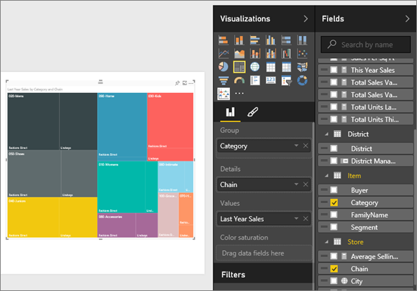
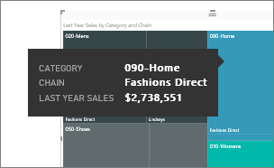

<properties
   pageTitle="在 Power BI 中的教學課程︰ Treemaps"
   description="在 Power BI 中的教學課程︰ Treemaps"
   services="powerbi"
   documentationCenter=""
   authors="mihart"
   manager="mblythe"
   backup=""
   editor=""
   tags=""
   featuredVideoId="rnMyiA6Nt6Y"
   qualityFocus="no"
   qualityDate=""/>

<tags
   ms.service="powerbi"
   ms.devlang="NA"
   ms.topic="article"
   ms.tgt_pltfrm="NA"
   ms.workload="powerbi"
   ms.date="10/14/2016"
   ms.author="mihart"/>

# 在 Power BI 中的教學課程︰ treemaps  

Treemaps 會顯示成一組巢狀矩形的階層式資料。  每個階層層級會以彩色矩形 （通常稱為 「 分支 」） 包含其他矩形 （「 分葉 」）。  每一個矩形內的空間配置要測量的量化值，以排列的由上往左 （最大） 大小的矩形以滑鼠右鍵 （小）。

例如，如果我要分析我銷售，可能有最上層的矩形 （分支） 的服裝類別目錄︰ **都市**, ，**Rural**, ，**Hope**, ，和 **混合**。  我的類別矩形會包含較小的矩形 （分葉） 的銷售數字為基礎的衣服會調整大小，加上陰影的類別、 與這些較小的矩形內的製造商。  在 **都市** 分支上述、 大量 Maximus 服裝銷售、 較少 Natura 和 Fama 和極少 Leo。  因此， **都市** 我 Treemap 的分支會有最大矩形 for Maximus （在左上角），稍微較小的矩形 Natura 和許多其他矩形代表所有其他服裝銷售和一個小矩形，Fama Leo。  我無法比較的所有其他的服裝類別銷售的項目數比較大小及每個分葉節點; 網底愈大矩形陰影越深，表示，這個值越高。

## 使用 treemap 的時機  
Treemaps 是相當好的選擇︰

-   若要顯示大量的階層式資料。

-   當橫條圖無法有效地處理大量的值。

-   若要顯示每個部分與整體之間的比例。

-   若要顯示的量值的分佈模式跨越類別目錄階層中的每個層級。

-   若要顯示屬性使用的大小和色彩編碼。

-   若要找出模式、 極端值、 最重要的參與者和例外狀況。

## 建立基本 treemap  

想要監看其他人，請先建立 treemap 嗎？  要監看，請跳至 2:01，在這段影片將會建立使用銷售和行銷範例 treemap。

<iframe width="560" height="315" src="https://www.youtube.com/embed/rnMyiA6Nt6Y?list=PL1N57mwBHtN0JFoKSR0n-tBkUJHeMP2cP" frameborder="0" allowfullscreen></iframe>

或者，建立您自己的樹狀。 這些指示使用零售分析範例。 如果要跟著做，  [下載範例](powerbi-sample-downloads.md), ，登入 Power BI，然後選取 **取得資料 \> Excel 活頁簿 \>  連接 \> 零售分析範例**。**xlsx**。

1.  在啟動 [編輯檢視](powerbi-service-interact-with-a-report-in-editing-view.md) ，然後選取 **銷售** > **最後一年銷售** 量值。   

2.  將圖表轉換成 treemap。  

3.  拖放到 **項目** > **類別** 至 **群組** 良好。 Power BI 建立 treemap 矩形的大小會反映總銷售額而色彩代表類別目錄。  基本上，您已建立的階層，以視覺化方式依分類說明總銷售額的相對大小。   **Mens** 類別都有最高的銷售和 **Hosiery** 類別目錄具有最低。
  

4.  拖放到 **存放區** > **鏈結** 至 **詳細資料** 也以完成您的樹狀。 您現在可以比較依類別和鏈結的去年銷售量。   

    >[AZURE.NOTE] 無法同時使用色彩飽和度和詳細資料。

5. 將滑鼠停留在 **鏈結** 以顯示該部分的工具提示的區域 **類別**。  例如，滑鼠游標停留於 **Lindseys** 中 **040 Juniors** 矩形會顯現 Juniors 類別 Lindsey 的部分的工具提示。  

5.  
            [做為儀表板] 的磚 (pin 視覺效果) 加入 treemap](powerbi-service-dashboard-tiles.md)。 

6.  
            [將報表儲存](powerbi-service-save-a-report.md)。

## 反白顯示和交叉篩選  
使用 [篩選] 窗格的相關資訊，請參閱 [將篩選加入至報表](powerbi-service-add-a-filter-to-a-report.md)。

反白顯示樹狀中的 [類別目錄或詳細資料跨反白顯示和交叉篩選 [報表] 頁面上的其他視覺效果]，反之亦然。 要跟著做，將一些視覺項目加入至相同的頁面或複製/貼上已有其他視覺效果的報表頁面樹狀。

1.  在樹狀中，選取類別中的鏈結。  這個跨-反白顯示在頁面上的其他視覺效果。 選取 **050 鞋**, ，比方說，顯示我去年的銷售量鞋已 $3,640,471 $2,174,185，來自直接的方式使用。  
    

2.  在 **鏈結的最後一個年度銷售額** 圓形圖中，選取 **的方式直接** 配量。  
    

3. 若要管理如何圖表跨反白顯示和交叉篩選彼此，請參閱 [Power BI 報表中的視覺效果互動](powerbi-service-visual-interactions.md)

## 請參閱  

            [在 Power BI 中的報表](powerbi-service-reports.md)  

            [報表中加入視覺效果](https://powerbi.uservoice.com/knowledgebase/articles/441777)  

            [在 Power BI 中的視覺效果類型](powerbi-service-visualization-types-for-reports-and-q-and-a.md)
[ 釘選視覺效果的儀表板](powerbi-service-pin-a-tile-to-a-dashboard-from-a-report.md)  

            [Power BI-基本概念](powerbi-service-basic-concepts.md)  

            [試試看-它的免費 ！](https://powerbi.com/)

更多的問題嗎？ 
            [試用 Power BI 社群](http://community.powerbi.com/)  
