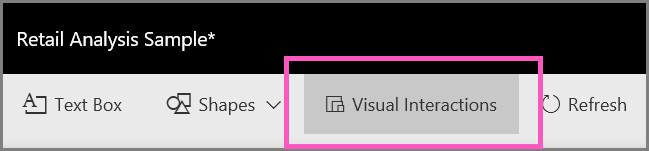

<properties
   pageTitle="變更報表中的視覺效果互動方式"
   description="如何設定 Visual 互動 Microsoft Power BI 報表中的文件。"
   services="powerbi"
   documentationCenter=""
   authors="mihart"
   manager="mblythe"
   backup=""
   editor=""
   tags=""
   featuredVideoId="N_xYsCbyHPw"
   qualityFocus="no"
   qualityDate=""/>

<tags
   ms.service="powerbi"
   ms.devlang="NA"
   ms.topic="article"
   ms.tgt_pltfrm="NA"
   ms.workload="powerbi"
   ms.date="08/25/2016"
   ms.author="mihart"/>

# Power BI 報表中的視覺效果互動

根據預設，報表頁面上的視覺效果可用來交叉篩選和交叉反白顯示在頁面上的其他視覺效果。
例如，選取地圖視覺效果的狀態會反白顯示直條圖，並篩選折線圖，顯示套用至該狀態的資料。
請參閱 [大約篩選和反白顯示](powerbi-service-about-filters-and-highlighting-in-reports.md)。

若要變更此預設行為，請使用 **視覺效果互動** 控制項。

>[AZURE.NOTE] 條款 *交叉篩選* 和 *跨反白顯示* 用來區別來自使用時，會發生什麼事這裡描述的行為 **篩選** 窗格來篩選和反白顯示視覺效果。  

<iframe width="560" height="315" src="https://www.youtube.com/embed/N_xYsCbyHPw?list=PL1N57mwBHtN0JFoKSR0n-tBkUJHeMP2cP" frameborder="0" allowfullscreen></iframe>

1.  選取視覺效果，讓它成為作用。  

2. 開啟 **Visual 互動** 從頂端功能表列中選取。 請注意篩選並反白顯示出現在 [報表] 頁面上的其他視覺效果上方的圖示。

    

2.  決定選取的視覺效果應該對其他產生的影響。  

    -   如果它應該交叉篩選其他視覺效果，請選取 **篩選** 圖示 。

    -   如果它應該跨-反白顯示該視覺效果，請選取 **反白顯示** 圖示 。

    -   如果它應該不會影響，請選取 **不會影響** 圖示 。

3.  在 [報表] 頁面上的所有視覺效果的重複。

## 請參閱

 [如何使用報表篩選](powerbi-service-how-to-use-a-report-filter.md)

[篩選和反白顯示在報表中](powerbi-service-about-filters-and-highlighting-in-reports.md)

[Power BI-基本概念](powerbi-service-basic-concepts.md)

更多的問題嗎？ [試用 Power BI 社群](http://community.powerbi.com/)
