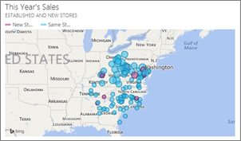
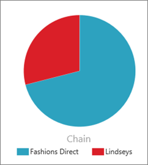
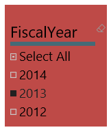

<properties
   pageTitle="在 Power BI 中的視覺效果類型"
   description="在 Power BI 中的視覺效果類型"
   services="powerbi"
   documentationCenter=""
   authors="mihart"
   manager="mblythe"
   backup=""
   editor=""
   tags=""
   qualityFocus="no"
   qualityDate=""/>

<tags
   ms.service="powerbi"
   ms.devlang="NA"
   ms.topic="article"
   ms.tgt_pltfrm="NA"
   ms.workload="powerbi"
   ms.date="09/17/2016"
   ms.author="mihart"/>
# 在 Power BI 中的視覺效果類型

## Power BI 視覺效果

我們將持續加入新的視覺效果，但請密切注意 ！

與社群網站，visuals.powerbi.com，其中您會發現清單的自訂視覺效果，您可以下載並使用您自己的儀表板和報表中。 感覺到創造力？  觀看這段影片以了解如何建立並加入您自己的視覺效果社群網站。  

## 使用 Power BI 中的視覺效果的清單

所有這些視覺效果可以加入至 Power BI 報表中，指定在問與答 A，並釘選到儀表板。

### 列和資料行圖表

 

 

            **秘訣**︰ 橫條圖會查看不同類別的特定值的標準。

### 基本 (Layered) 和堆疊區域圖

            **秘訣**: 基本區域圖表根據與軸之間列填滿區域的折線圖。

如需詳細資訊，請參閱 [教學課程︰ 基本區域圖](powerbi-service-tutorial-basic-area-chart.md)。

### 單一數字的卡片

如需詳細資訊，請參閱 [建立大的數字磚儀表板](powerbi-service-create-a-big-number-tile-for-a-dashboard.md)。

### 多個資料列的卡片

### 組合圖表

            **秘訣**︰ 組合式圖表結合了直條圖和折線圖。 選擇 *列和堆疊的直條* 和 *號和叢集資料行*。

如需詳細資訊，請參閱 [教學課程︰ 在 Power BI 中的組合圖表](powerbi-service-tutorial-combo-chart-merge-visualizations.md)。

### 環圈圖

            **秘訣**︰ 環圈圖的類似於圓形圖。  它們會顯示部份與整體的關係。

如需詳細資訊，請參閱 [教學課程︰ 在 Power BI 中的環圈圖](powerbi-service-tutorial-doughnut-charts.md)。

### 漏斗圖

            **秘訣**︰ 漏斗協助您設想有階段和項目到下一個循序從一個階段流程的處理序。  階段，例如銷售的程序會導致開始，並以購買履行之間序列流程時，請使用漏斗圖。

如需詳細資訊，請參閱 [教學課程︰ 在 Power BI 中的漏斗圖](powerbi-service-tutorial-funnel-charts.md)。

### 量測計的圖表

            **秘訣**︰ 顯示目標的內容中的目前狀態。

如需詳細資訊，請參閱 [教學課程︰ 在 Power BI 中的量測計圖表](powerbi-service-tutorial-radial-gauge-charts.md)。

###   KPI

            **秘訣**︰ 顯示進度可測量的目標。

如需詳細資訊，請參閱 [教學課程︰ 在 Power BI 中的 Kpi](powerbi-service-tutorial-kpi.md)。

### 折線圖

            **秘訣**︰ 強調通常經過一段時間的值，整個系列的整體圖形。

### 對應 （基本）

            **Ti p**︰ 用來將類別和數量的資訊空間位置與關聯。

如需詳細資訊，請參閱 [秘訣和訣竅地圖視覺效果](powerbi-service-tips-and-tricks-for-power-bi-map-visualizations.md)。

### 填滿的對應 (Choropleth)

            **秘訣**︰ 更密集的色彩、 較大的值。

如需詳細資訊，請參閱 [教學課程︰ 在 Power BI 中的填入對應](powerbi-service-tutorial-filled-maps-choropleths.md)。

### 矩陣

### 圓形圖

### 散佈圖和泡泡圖

            **秘訣**︰ 在何種順序、 等不顯示 （散佈圖） 2 或 3 （泡泡） 數量的量值-之間的關聯性。

如需詳細資訊，請參閱 [教學課程︰ 散佈圖 Power BI 中的](powerbi-service-tutorial-scatter.md)。

### 交叉分析篩選器

如需詳細資訊，請參閱 [教學課程︰ 在 Power BI 中的交叉分析篩選器](powerbi-service-tutorial-slicers.md)。

### 獨立映像

如需詳細資訊，請參閱 [映像 widget 加入儀表板](powerbi-service-add-a-widget-to-a-dashboard.md)。

### 資料表

            **秘訣**︰ 可搭配量化比較項目也有許多類別。

### 樹狀目錄中的對應

如需詳細資訊，請參閱 [教學課程︰ 在 Power BI 中的 Treemaps](powerbi-service-tutorial-treemaps.md)。

            **秘訣**︰ 也就是圖表之彩色矩形，代表值的大小。  它們可以是階層式，具有主要矩形內的巢狀的矩形。

### 瀑布圖

            **秘訣**︰ 瀑布圖會顯示所執行的總加入或減去的值時。

如需詳細資訊，請參閱 [Power BI 中的教學課程瀑布圖](powerbi-service-tutorial-waterfall-charts.md)。

###

## 告訴問答集若要使用哪一個視覺效果

輸入時透過 Power BI 問與答的自然語言查詢，您可以在查詢中指定的視覺效果類型。  例如：

「***業績狀態為 treemap***」

## 請參閱

[Power BI 報表中的視覺效果](powerbi-service-visualizations-for-reports.md)

[在 Power BI 中的報表](powerbi-service-reports.md)

[Power BI-基本概念](powerbi-service-basic-concepts.md)

更多的問題嗎？ [試用 Power BI 社群](http://community.powerbi.com/)
