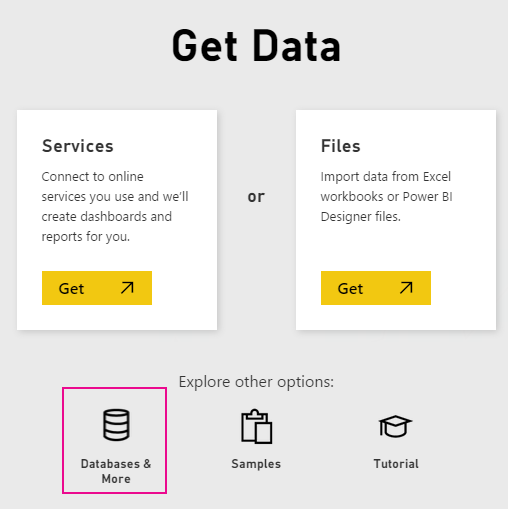
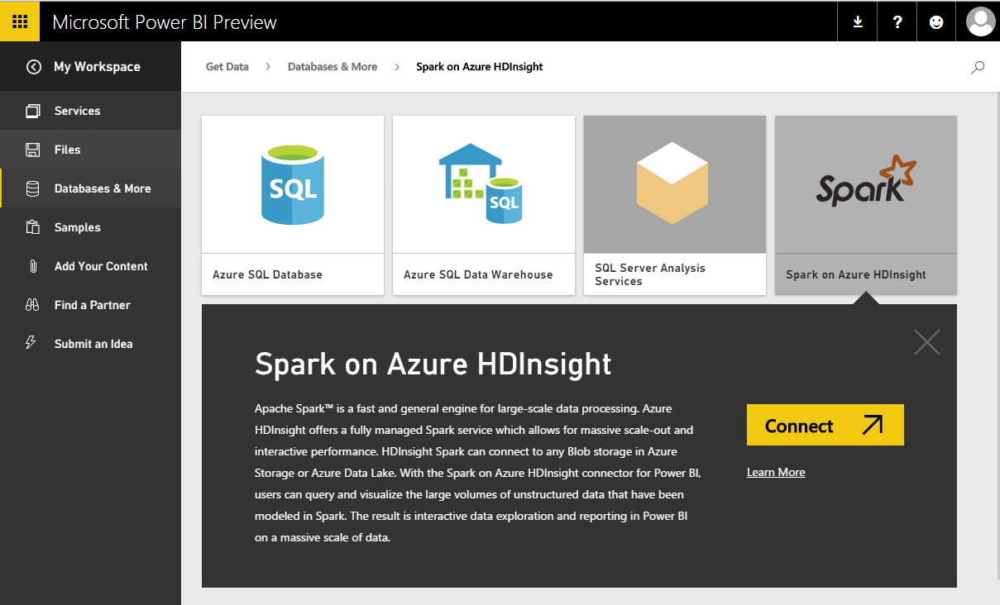
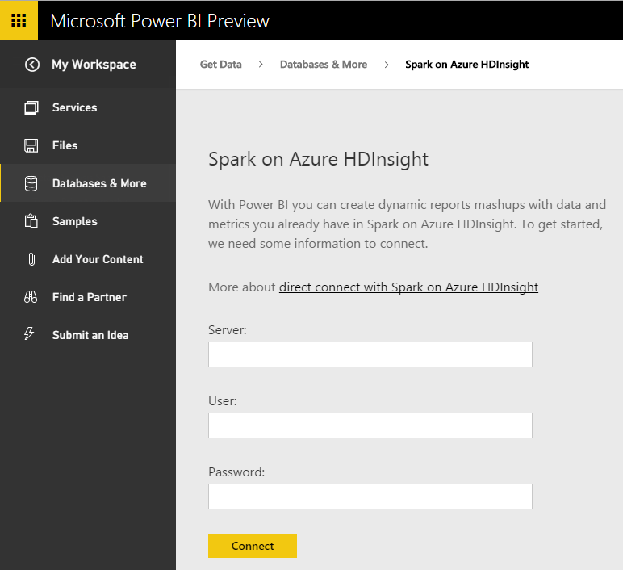
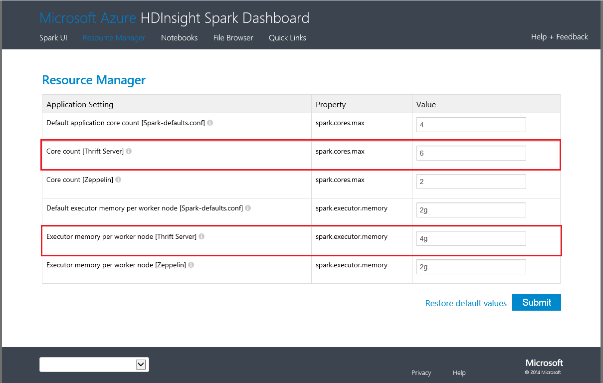

<properties
   pageTitle="DirectQuery 與 HDInsight 上的 Spark"
   description="DirectQuery 與 HDInsight 上的 Spark"
   services="powerbi"
   documentationCenter=""
   authors="guyinacube"
   manager="mblythe"
   backup=""
   editor=""
   tags=""
   qualityFocus="no"
   qualityDate=""/>

<tags
   ms.service="powerbi"
   ms.devlang="NA"
   ms.topic="article"
   ms.tgt_pltfrm="NA"
   ms.workload="powerbi"
   ms.date="09/09/2016"
   ms.author="asaxton"/>

# DirectQuery 與 HDInsight 上的 Spark

DirectQuery 以在 Azure HDInsight Spark 可讓您建立動態報告根據資料和度量您已在 Spark 叢集。 使用 DirectQuery，查詢會傳送回到您的 Azure HDInsight Spark 叢集，當您瀏覽 [報表] 檢視中的資料。 對於熟悉使用者與它們連線至實體，建議這種經驗。

> [AZURE.WARNING] Spark 基礎資料集上建置的儀表板磚已停用自動並排顯示重新整理。 您可以選取 **重新整理儀表板磚** 手動重新整理。 報表不會受到影響，應保持最新狀態。 

-   每個動作，例如選取資料行或新增篩選條件會傳送回資料庫 – 查詢，選取非常大的欄位之前，請考慮選擇適當的視覺效果類型。
-   問答集不適用於 DirectQuery 資料集。
-   不會自動挑選結構描述變更。
-   群組，僅適用於 [Power BI Pro](powerbi-power-bi-pro-content-what-is-it.md)。

隨著我們持續改善使用體驗，可能會變更這些限制和備註。 連接的步驟如下所述。  其他文件，請參閱 [使用 BI 工具，使用 Azure HDInsight 上的 Apache Spark](https://azure.microsoft.com/documentation/articles/hdinsight-apache-spark-use-bi-tools/)

1. 選取 **取得資料** 左的導覽窗格的底部。  
      

2. 選取 **資料庫和其他資訊**。  
    

3. 選取 **HDInsight 上的 Spark** 連接器，然後選擇 **連接**。  
      

4. 輸入的名稱 **伺服器** 您想要連接，以及您 **username** 和 **密碼**。 伺服器一定是在表單中 \<clustername\>。 azurehdinsight.net，查看更多詳細尋找下面這些值。  
      

5. 連線之後，您會看到新的具名 「 SparkDataset 」 資料集。 您也可以透過建立 [預留位置] 磚存取資料集。  
      

6. 深入探索資料集，您可以瀏覽的所有資料表和資料行在資料庫中。 選取資料行，將查詢傳送回來源，以動態方式建立視覺效果。 這些視覺效果可儲存在新的報表，並釘選回到您的儀表板。

## 尋找您的 Spark HDInsight 參數  
伺服器一定是在表單中 \<clustername\>。 azurehdinsight.net，可以在您的入口網站中找到︰  
    

使用者名稱和密碼也可以在入口網站中找到。

## 疑難排解  
如果您要達到問題對您的叢集執行查詢，確認應用程式仍在執行中，必要時重新啟動。

您也可以將配置的資源管理員中的其他資源︰  
    

## 請參閱  

[開始使用 Power BI](powerbi-service-get-started.md)  
[取得 Power BI 中的資料](powerbi-service-get-data.md)  
更多的問題嗎？ [試用 Power BI 社群](http://community.powerbi.com/)