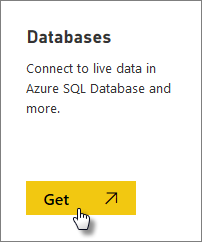
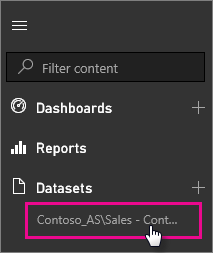

<properties
   pageTitle="SQL Server Analysis Services Power BI 中的即時資料"
   description="SQL Server Analysis Services 即時 Power BI 中的資料。 這是透過企業閘道已設定的資料來源。"
   services="powerbi"
   documentationCenter=""
   authors="guyinacube"
   manager="mblythe"
   backup=""
   editor=""
   tags=""
   qualityFocus="no"
   qualityDate=""/>

<tags
   ms.service="powerbi"
   ms.devlang="NA"
   ms.topic="article"
   ms.tgt_pltfrm="NA"
   ms.workload="powerbi"
   ms.date="09/21/2016"
   ms.author="asaxton"/>
# SQL Server Analysis Services Power BI 中的即時資料

在 Power BI，有兩種方式，您可以連接到即時 SQL Server Analysis Services 伺服器。 在取得資料，您可以連接到 SQL Server Analysis Services 伺服器，或者您可以連接到 [Power BI Desktop 檔案](powerbi-service-powerbi-desktop-files.md), ，或 [Excel 活頁簿](powerbi-service-excel-data.md), ，已經連接到 Analysis Services 伺服器。 

  **重要事項：**

-   若要連接到即時 Analysis Services 伺服器，必須安裝和設定的系統管理員內部資料閘道。 如需詳細資訊，請參閱 [內部資料閘道](powerbi-gateway-onprem.md)。

-   當您使用閘道時，您的資料會保留在內部。  您建立的報表為基礎的資料會儲存在 Power BI 服務。 

-   
            [問與答自然語言查詢](powerbi-service-q-and-a-direct-query.md) 僅供預覽的 Analysis Services 即時連接。

> [AZURE.NOTE] 使用即時 Analysis Services 伺服器，以及群組的 Pro 功能。 [進一步了解](powerbi-power-bi-pro-content-what-is-it.md)

## 若要連接到模型中取得資料

1.  在 **我的工作區**, ，請選取 **取得資料**。 如果有的話，您也可以變更群組工作區。

    

2.  選取 **資料庫和其他資訊**。

    

3.  選取 **SQL Server Analysis Services** > **連接**。 

    

4.  選取伺服器。 如果您沒有看到這裡列出的任何伺服器，表示未設定閘道和資料來源，或是您的帳戶未列在 **的使用者** 在閘道中的資料來源] 索引標籤。 請洽詢您的管理員解決這個問題。

5.  選取您想要連接到的模型。 這可能是表格式或多維度。

連接至模型之後，它會出現在 Power BI 網站中 **我的工作區/資料集**。 如果您 swtiched 群組工作區，則會出現群組內資料集。

如果您釘選視覺效果從報表的儀表板，已釘選的磚會自動重新整理每隔 10 分鐘。 如果您的內部部署 Analysis Services 伺服器中的資料更新時，會在 10 分鐘後自動更新磚。

## 請參閱

[內部資料閘道](powerbi-gateway-onprem.md)  
[管理 Analysis Services 資料來源](powerbi-gateway-enterprise-manage-ssas.md)  
[疑難排解內部部署資料閘道](powerbi-gateway-onprem-tshoot.md)  
更多的問題嗎？ [試用 Power BI 社群](http://community.powerbi.com/)