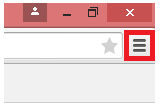

<properties 
   pageTitle="支援的語言和國家/地區 Power bi"
   description="支援的語言和國家/地區 Power bi"
   services="powerbi" 
   documentationCenter="" 
   authors="maggiesMSFT" 
   manager="erikre" 
   backup=""
   editor=""
   tags=""
   qualityFocus="monitoring"
   qualityDate="05/02/2016"/>
 
<tags
   ms.service="powerbi"
   ms.devlang="NA"
   ms.topic="get-started-article"
   ms.tgt_pltfrm="NA"
   ms.workload="powerbi"
   ms.date="10/14/2016"
   ms.author="maggies"/>
# 支援的語言和國家/地區 Power bi

如國家和地區，Power BI 可供使用，請參閱這 [國際可用性清單](https://products.office.com/business/international-availability)。 

## Power BI 服務的語言

Power BI 服務 （在瀏覽器） 有下列 42 語言版本︰

-   阿拉伯文
-   巴斯克文-巴斯克文
-   保加利亞文-Български
-   卡達隆尼亞-català
-   中文 （簡體）-中文(简体)
-   中文 （繁體）-中文(繁體)
-   克羅埃西亞文-hrvatski
-   捷克文-čeština
-   丹麥文-dansk
-   荷蘭文-荷蘭
-   英文-英文
-   愛沙尼亞文-eesti
-   芬蘭文-suomi
-   法文-français
-   加里斯亞-galego
-   德文-德國
-   希臘文-Ελληνικά
-   希伯來文
-   印度文-हिंदी
-   匈牙利文-magyar
-   印尼文-印尼文
-   義大利文-italiano
-   日文-日本語
-   哈薩克文-Қазақ
-   韓文-한국어
-   拉脫維亞文-latviešu
-   立陶宛文-lietuvių
-   馬來文-印尼 Melayu
-   挪威文 （巴克摩）-文 （巴克摩）
-   波蘭文-Polski
-   葡萄牙文 （巴西）-Português
-   葡萄牙文 （葡萄牙）-português
-   羅馬尼亞文-română
-   俄文-Русский
-   塞爾維亞文 （斯拉夫）-српски
-   塞爾維亞文 （拉丁）-srpski
-   斯洛伐克文-slovenčina
-   斯洛維尼亞文-slovenski
-   西班牙文-西班牙
-   瑞典文-svenska
-   泰文-ไทย
-   土耳其文-Türkçe
-   烏克蘭文-українська
-   越南文-Tiếng Việt

## 什麼被轉譯

功能表、 按鈕、 訊息和經驗的其他項目轉譯為您的語言，讓您更輕鬆地瀏覽並與 Power BI 互動。

此時，幾項功能僅提供英文版︰

-   儀表板和報表，Power BI 會為您建立，當您連接到服務，例如 Microsoft Dynamics CRM、 Google 分析、 Salesforce 等。 （您仍然可以建立您自己的儀表板和報表中您自己的語言。）

-   探索您的資料使用問與答。

敬請期待，隨著我們處理傳送至其他語言的其他功能。 

## 在 Power BI 服務中選擇您的語言

1. 在 Power BI 服務中，選取 **設定** 圖示  > **設定**。

2. 在 **一般** ] 索引標籤 > **語言**。

3. 選取您的語言 > **套用**。

## 在瀏覽器中選擇您的語言

Power BI 會偵測您根據您的電腦上的語言喜好設定的語言。 您存取和變更這些喜好設定的方式會視您的作業系統和瀏覽器。 以下是如何從 Internet Explorer 和 Google Chrome 存取這些喜好設定。

### Internet Explorer （第 11 版）

1.  按一下 [瀏覽器視窗右上角的 [工具] 按鈕︰

    

2.  按一下 [ **網際網路選項**。

3.  在 [網際網路選項] 對話方塊的 [外觀] 下，[一般] 索引標籤上，按一下 [ **語言** ] 按鈕。

### Google Chrome （版本 42）

1.  按一下 [瀏覽器視窗右上角的功能表按鈕︰

    

2.  按一下 [設定] ****。

3.  按一下 [ **顯示進階設定**。

4.  在語言中，按一下 [ **語言及輸入的設定** ] 按鈕。

5.  按一下 [ **新增**, ，選取一種語言，然後按一下 **確定**。

    

    新的語言是在清單結尾處。 

6.  將新的語言拖曳到清單頂端，按一下 [ **以該語言顯示 Google Chrome**。

    

    您可能需要關閉再重新開啟瀏覽器才能看到變更。

## 當您下載 Power BI Desktop，請選擇您的語言

您可以選取語言，當您下載 Power BI Desktop。 

-  移至 [Power BI Desktop 下載頁面](https://www.microsoft.com/download/details.aspx?id=45331)。

Power BI Desktop 中變更語言的唯一方式是前往下載頁面，並下載其他語言。

## 在 Power BI Desktop 中選擇的地區設定的報表

您可以設定特定的報表是在您的 Power BI Desktop 版本的地區設定以外的地區設定 （日期和數字格式）。 

1.  移至 **檔案** > **選項和設定** > **選項**。
2.  在 **目前檔案**, ，請選取 **資料載入**。
3.  在 **地區設定** 方塊中，選取不同的地區設定。 

    

## [說明] 文件的語言

這些 10 種語言當地語系化說明︰ 

-   中文 （簡體）-中文(简体)
-   中文 （繁體）-中文(繁體)
-   法文-français
-   德文-德國
-   義大利文-italiano
-   日文-日本語
-   韓文-한국어
-   葡萄牙文 （巴西）-Português
-   俄文-Русский
-   西班牙文-西班牙

### 請參閱 
請嘗試詢問 [Power BI 社群](http://community.powerbi.com/)。

