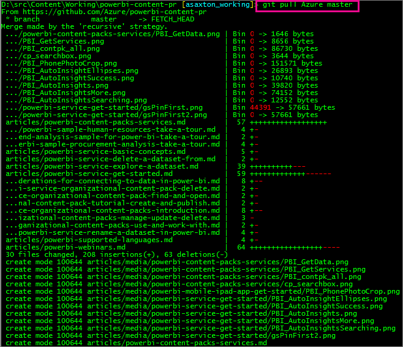
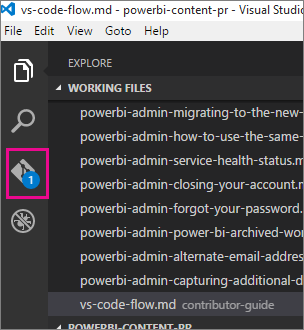
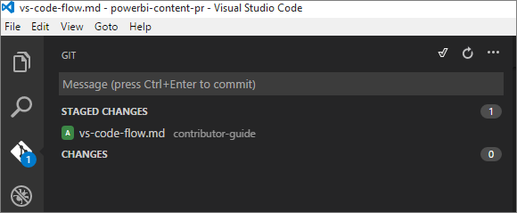

<properties
pageTitle="Visual Studio 程式碼的流程"
description="如何使用 Visual Studio 程式碼和 Power BI 儲存機制的逐步教學課程。"
services=""
documentationCenter=""
authors="guyinacube"
manager="mblythe"
editor=""/>

<tags
ms.service="contributor-guide"
ms.devlang=""
ms.topic="article"
ms.tgt_pltfrm=""
ms.workload=""
ms.date="11/09/2015"
ms.author="asaxton"/>

# Visual Studio 程式碼的流程

這會逐步引導您可以使用 Visual Studio 程式碼與 Power BI Git 儲存機制。 您可以從 https://code.visualstudio.com/ VS 程式碼。

## 優點

有幾個優點，而不是 ATOM 之類的其他工具使用 Visual Studio 程式碼。  由於製作程序更加順暢，並可讓您在單一工具中，供大部分活動使用的 Git 整合。 另外還有這樣好忽略其他的文件的工作檔案區段。

## 第一次更新您的本機重新產生

您仍然需要使用 Git 命令列的一些作業。  首先是，我們應該一律提取之前您開始進行變更。  如此可確保您的儲存機制/分支會根據主要的 Azure 主要分支。

若要從 Azure/powerbi 內容-pr 拉更新，請執行下列命令。

    git pull Azure master
    

 
您會看到 **Azure** 上述命令中所列。  在您的情況下，可能是 **上游**。  您會收到錯誤指出不存在。  此外，它是 *區分大小寫*！  您可以確認您是否方法 *git 遠端顯示*。

它是個不錯的主意執行狀態的命令，並確定我們都保持同步。

    git status

在此情況下，本機儲存機制已提前 **原點**。

因為它會指出，只要做 **推播** 和 **原點** 應符合您的本機儲存機制。  

    git push

## 本機資料夾

這是假設您已經有複製重現到您的電腦，以及其所在的本機資料夾中。 

開啟 VS 程式碼之後，請移至 **檔案** > **開啟資料夾...**。  指向您的本機副本資料夾。  這會顯示所有檔案，該結構中。

## 工作檔案

當您編輯檔案，它們會顯示在 **工作檔案** 一節。 您可以移除這些工作檔案上它旁邊的 [X] 即可。  

當您開啟及關閉 VS 程式碼，將會保留這份清單。 它會以專注於您贏了，這些檔案，並略過雜訊其他手動方式。 此區域的唯一缺點是無法調整大小。

## Markdown 預覽

您可以看到 markdown 的預覽，進行下列其中一項。

- 以滑鼠右鍵按一下檔案，然後選取 **開啟預覽**。

    

- 選取 **開啟預覽** 右上方，當有開啟的文件中的圖示。

    

## Git 認可

這是其中 VS Code 好用。  您所做的變更，VS 程式碼將會追蹤所做的變更進行簽入。  項目變更時，[Git] 圖示，左邊，將有編號的指標旁它顯示的變更數目。

選取該圖示會顯示我們的變更清單。

您可以選取 **+** 上 **變更** 列上方。  或者，您可以選取 **+** 您想要認可的每個個別檔案旁邊。  選取 **+** 將 *階段* 檔案。

暫存檔案之後，您可以在訊息方塊中，加入註解，然後選取 [核取圖示。  核取記號圖示，將實際執行 Git 認可動作。

## 將檔案推送至 GitHub 的上一步

一旦您擁有已確認某些檔案，您必須回到 git 命令殼層並問題 **推播** 命令傳送至 GitHub。

    git push

您可以保留回到編輯檔案、 認可和推送到您工作。

## 提取要求

當您使用的所有變更 don，您必須發出 **提取要求** 本身 GitHub 網站上，這完成。

